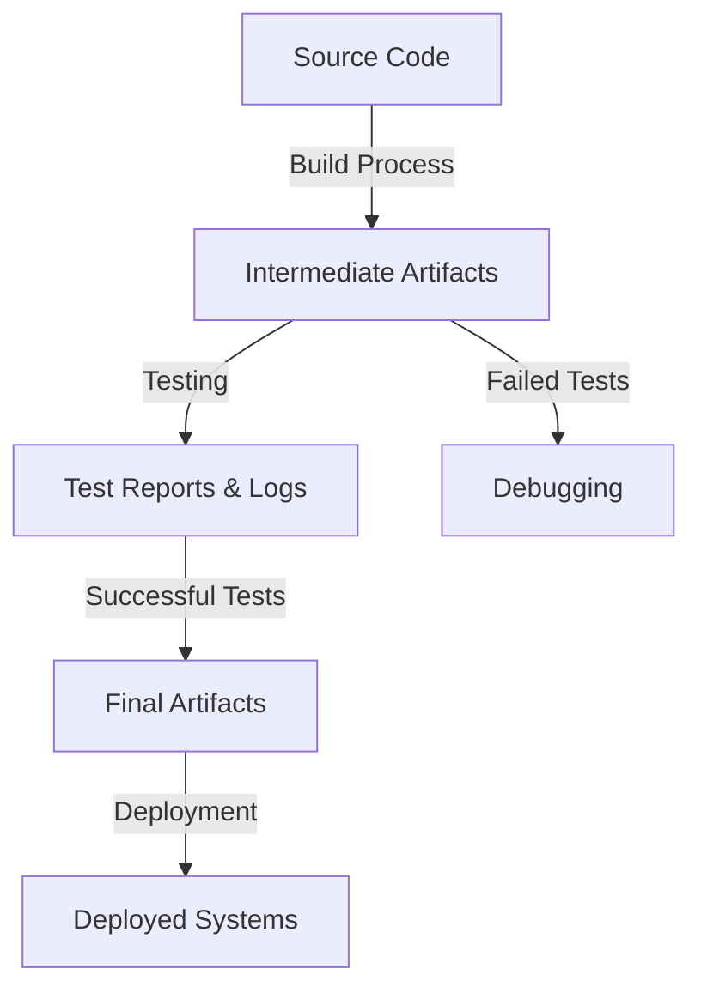

# **Understanding Artifacts: Theory and Practical Applications**

In the context of software development, an artifact refers to a byproduct or a result of a process, such as a build, test, or deployment. Artifacts can take many forms, including images, binaries, and other files. In this article, we'll delve into the theory behind artifacts, explore their similarities and differences with images, and discuss practical applications, including GitHub Actions artifacts, ECR, and other use cases.

**Theory: What are Artifacts?**
-----------------------------

Artifacts are the tangible outputs of a software development process. They can be thought of as the "leftovers" of a build, test, or deployment process. Artifacts can include:

* Compiled binaries
* Package files (e.g., JAR, WAR, ZIP)
* Images (e.g., Docker images)
* Logs
* Test reports
* Deployment scripts

Artifacts serve several purposes, including:

* **Repeatability**: Artifacts enable repeatable builds, tests, and deployments, ensuring that the process can be reproduced identical results.
* **Reusability**: Artifacts can be reused across different environments, reducing the need for redundant builds and deployments.
* **Auditing**: Artifacts provide a record of the development process, allowing for auditing and tracing of changes.

### Expanded Concepts:

Artifacts can also be categorized based on their lifecycle and usage:

1. **Intermediate Artifacts**: These are temporary outputs, like intermediate compiled files, that exist only during the build process and are discarded after completion.
2. **Final Artifacts**: These are the end products of a pipeline, such as executables, Docker images, or deployment scripts, intended for long-term use.
3. **Metadata Artifacts**: Logs and test reports fall into this category, offering valuable insights for debugging and optimization but not directly used in deployments.

!!! note
    Artifacts are crucial for ensuring traceability and transparency in complex systems. By maintaining a well-organized artifact repository, teams can streamline collaboration and enhance accountability.

**Similarities and Differences with Images**
------------------------------------------

Images, such as Docker images, are a type of artifact. However, not all artifacts are images. The key differences between artifacts and images are:

* **Purpose**: Artifacts are the byproducts of a process, while images are designed to be executed or run.
* **Format**: Artifacts can take many formats, including binaries, text files, and logs, while images are typically containerized (e.g., Docker) or virtual machine (e.g., VM) images.
* **Lifecycle**: Artifacts are typically short-lived, while images can be long-lived and reused across multiple environments.

### **Mermaid Diagram: Artifact Lifecycle**

**Practical Applications**
-------------------------

Artifacts have numerous practical applications in software development, including:

* **GitHub Actions Artifacts**: GitHub Actions allow you to upload and store artifacts as part of your CI/CD pipeline. This enables you to share artifacts across jobs and workflows, making it easier to manage and reuse build outputs.
* **ECR (Elastic Container Registry)**: ECR is a container registry that allows you to store and manage Docker images. While ECR is primarily used for images, it can also be used to store other types of artifacts, such as binaries and packages.
* **Other Use Cases**: Artifacts can be used in various other contexts, such as:
  + **Continuous Integration**: Artifacts can be used to store and reuse build outputs, reducing the need for redundant builds.
  + **Continuous Deployment**: Artifacts can be used to store and manage deployment scripts and configurations.
  + **QA and Testing**: Artifacts can be used to store and manage test reports and logs.

### **Best Practices for Artifact Management**

1. **Version Control**: Always version your artifacts to maintain consistency and traceability.
2. **Access Control**: Restrict access to artifact repositories to ensure security and prevent tampering.
3. **Automated Cleanup**: Implement policies to clean up outdated or unused artifacts, saving storage and reducing clutter.

**Getting Started with Artifacts**
----------------------------------

To get started with artifacts, follow these steps:

1. **Identify your artifacts**: Determine what types of artifacts your development process produces.
2. **Choose an artifact repository**: Select a repository to store and manage your artifacts, such as GitHub Actions or ECR.
3. **Implement artifact management**: Integrate artifact management into your CI/CD pipeline, using tools like GitHub Actions or Jenkins.
4. **Monitor and analyze artifacts**: Regularly review and analyze your artifacts to identify trends, issues, and areas for improvement.

**Implementation Layout**
-------------------------

When implementing artifact management, consider the following layout:

* **Artifact Repository**: Store and manage artifacts in a centralized repository.
* **CI/CD Pipeline**: Integrate artifact management into your CI/CD pipeline, using tools like GitHub Actions or Jenkins.
* **Artifact Storage**: Store artifacts in a designated storage location, such as Amazon S3 or Google Cloud Storage.
* **Artifact Retrieval**: Retrieve artifacts as needed, using APIs or command-line tools.

!!! tip "Tip"
    Use tools like `jq` or `curl` to interact with artifact storage APIs for efficient retrieval and automation.

By understanding and leveraging artifacts, you can improve the efficiency, repeatability, and reusability of your software development process. Whether you're using GitHub Actions, ECR, or other tools, artifacts play a critical role in modern software development.

---

**References:**

1. [GitHub Actions Documentation](https://docs.github.com/en/actions)
2. [AWS Elastic Container Registry](https://aws.amazon.com/ecr/)
3. [Best Practices for Artifact Management](https://example.com)
