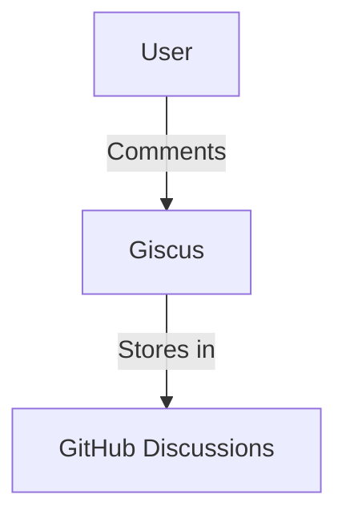

# **Integrating Giscus: Embracing the Power of Open Source and Community-Driven Commenting**

In the world of open source software, community-driven projects have revolutionized the way we develop, share, and interact with technology. One such project that embodies the spirit of open source is Giscus, a commenting system that empowers bloggers and website owners to foster meaningful discussions with their audience. In this article, we'll delve into the philosophy of open source software, explore the benefits of Giscus, and guide you through the process of integrating it into your website. We'll also highlight advanced customization options, potential challenges, and the broader implications of adopting open source technology.

<!-- more -->

---

## The Philosophy of Open Source Software

Open source software is built on the principles of collaboration, transparency, and community involvement. By making the source code freely available, developers can contribute, modify, and distribute the software, leading to a richer and more diverse ecosystem. This approach has given rise to some of the most influential and widely-used technologies, including Linux, WordPress, and Git.

### Key Principles of Open Source:
1. **Freedom to Use**: Anyone can use the software for any purpose.
2. **Access to Source Code**: Developers have access to the software's source code to understand how it works.
3. **Collaborative Improvement**: Open source projects thrive on contributions from a global community of developers.

Giscus, as an open source project, embraces this philosophy by encouraging contributions from the community. By leveraging the collective expertise and creativity of its users, Giscus has evolved into a robust and feature-rich commenting system that rivals its proprietary counterparts.

---

## The Benefits of Giscus

Why choose Giscus over other commenting systems? Here are several compelling reasons:

### Community-Driven Development
Giscus is developed and maintained by a passionate community of developers. This ensures continuous improvements, timely updates, and a feature set tailored to user needs.

### GitHub Integration
Giscus leverages GitHub discussions for managing comments. This integration enables:
- **Centralized comment moderation**: Use your GitHub repository to review and manage discussions.
- **User familiarity**: Many developers are already comfortable with GitHub’s interface, reducing the learning curve.

### Customizability
Giscus allows for deep customization. You can:
- Adjust its appearance to match your website’s branding.
- Fine-tune its behavior using configuration options in the script.
- Add custom themes or extend functionality using plugins.

### Performance Optimization
Compared to heavier proprietary commenting systems, Giscus is lightweight and fast. This ensures:
- Minimal impact on website loading times.
- Improved user experience, especially for visitors with slower internet connections.

### Open Source Advantages
Being open source means:
- **Cost-Effectiveness**: Giscus is free to use and distribute.
- **Transparency**: You can audit its source code for security and reliability.
- **Community Support**: Benefit from a robust network of contributors and users.

---

## Learning How Embedding JavaScript Works

To integrate Giscus into your website, you’ll need to embed a JavaScript snippet into your HTML code. This may seem daunting at first, but it’s a perfect opportunity to familiarize yourself with the basics of JavaScript and its role in web development.

### What Happens When You Embed JavaScript?
JavaScript is a client-side scripting language that allows you to add dynamic functionality to your website. By embedding a JavaScript snippet, you're essentially asking the browser to execute a set of instructions that will:
1. Retrieve necessary data from GitHub Discussions.
2. Render the Giscus interface dynamically on your webpage.
3. Enable interactive features like posting and viewing comments.

Here’s an example of the Giscus integration snippet:
```html
<script src="https://giscus.app/client.js"
        data-repo="your-github-repo"
        data-repo-id="your-repo-id"
        data-category="General"
        data-category-id="category-id"
        data-mapping="specific"
        data-strict="0"
        data-reactions-enabled="1"
        data-emit-metadata="0"
        data-input-position="bottom"
        data-theme="light"
        data-lang="en"
        crossorigin="anonymous"
        async>
</script>
```

Replace placeholders with your GitHub repository information, and your commenting system will be ready to go.

---

## Advanced Features and Enhancements

### Custom Themes and Styling
Giscus supports custom themes, allowing you to align its appearance with your brand’s aesthetics. For example:
- Use the `data-theme` attribute to set predefined themes.
- Implement CSS overrides for granular control.

### Accessibility and Localization
Giscus is designed with accessibility in mind. Additionally, it supports multiple languages, making it suitable for global audiences. Specify your preferred language using the `data-lang` attribute.

### Integrating Mermaid Diagrams for Documentation
For technical blogs or documentation, you can enhance the visual experience by adding diagrams created with Mermaid.js. For instance:



This visual representation showcases the interaction between users, Giscus, and GitHub.

---

## Challenges and How to Overcome Them

### Initial Setup Complexity
Setting up Giscus involves integrating GitHub Discussions and configuring several attributes. However, following the official [documentation](https://giscus.app) simplifies the process.

### Dependency on GitHub
While GitHub integration is a strength, it also means that Giscus depends on GitHub’s availability. Ensure that your use case aligns with this dependency.

---

## Encouragement to Try Something New

Integrating Giscus is more than just adding a feature; it’s a learning journey. You’ll gain:
- Insights into open source ecosystems.
- Practical JavaScript experience.
- A connection to a community of like-minded developers.

---

## Connecting with Your Audience

At its core, Giscus fosters connections by enabling meaningful discussions. By integrating it into your website, you provide your audience with:
- A platform to voice their thoughts.
- An opportunity to engage with your content deeply.

By embracing Giscus, you’re not just adding a tool but actively participating in the growth of the open source community. Join the movement today and create a more connected and collaborative digital experience.
