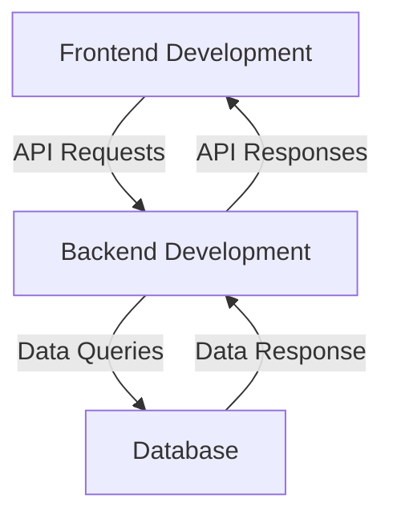

# Exploring the Diverse World of Tech R&D Jobs

The tech industry is a vast and rapidly evolving field, with a wide range of job opportunities available in research and development (R&D). From designing and building software applications to managing projects and ensuring data quality, tech R&D encompasses a broad spectrum of roles. In this article, we'll delve into six key types of jobs in tech R&D, highlighting the unique responsibilities and requirements of each.

<!-- more -->

---

### 1. Backend Development

Backend developers focus on the server-side of applications, designing and building the underlying infrastructure that powers websites, mobile apps, and other digital platforms. Their primary responsibilities include:

* Writing server-side code in languages like **Java**, **Python**, or **Ruby**.
* Integrating with databases and APIs to retrieve and manipulate data.
* Ensuring scalability, security, and performance of the application.
* Collaborating with frontend developers to create a seamless user experience.

Backend developers are essential to the development of any application, and their work has a direct impact on the user experience.

**Key Tools and Technologies**:

- **Databases**: MySQL, PostgreSQL, MongoDB
- **Frameworks**: Django, Spring Boot, Flask
- **Cloud Platforms**: AWS, Google Cloud, Microsoft Azure

!!!tip "Role Comparison"
    Backend developers differ from frontend developers in their focus. While backend developers handle the server and database logic, frontend developers manage the interface users interact with.

---

### 2. Frontend Development

Frontend developers, on the other hand, concentrate on the client-side of applications, creating the user interface and user experience (UI/UX) that users interact with. Their key responsibilities include:

* Writing client-side code in languages like **JavaScript**, **HTML**, and **CSS**.
* Designing and building responsive, intuitive, and visually appealing interfaces.
* Ensuring cross-browser compatibility and accessibility.
* Working closely with backend developers to integrate frontend code with server-side logic.

Frontend developers play a critical role in creating engaging and user-friendly applications that meet the needs of diverse user bases.

**Key Tools and Technologies**:

- **Frameworks**: React, Angular, Vue.js
- **Design Tools**: Figma, Adobe XD, Sketch
- **Testing**: Jest, Selenium, Cypress

---

### 3. Full Stack Development

Full stack developers are versatile professionals who possess expertise in both backend and frontend development. They can handle all aspects of application development, from designing and building the user interface to writing server-side code and integrating with databases. Full stack developers are responsible for:

* Developing complete applications, from concept to deployment.
* Writing code in a variety of programming languages, including **JavaScript**, **Python**, and **Ruby**.
* Managing and integrating third-party libraries and frameworks.
* Troubleshooting and debugging issues across the entire application stack.

**Mermaid Diagram: Full Stack Workflow**

Full stack developers are highly sought after, as they can work on all layers of an application, making them invaluable to development teams.

---

### 4. Data Science and Modelling

Data scientists and modellers are responsible for extracting insights and knowledge from complex data sets, using techniques like machine learning, statistical analysis, and data visualization. Their primary responsibilities include:

* Collecting, processing, and analyzing large data sets.
* Developing and deploying predictive models and algorithms.
* Creating data visualizations and reports to communicate findings.
* Collaborating with stakeholders to integrate data-driven insights into business decisions.

**Key Tools and Techniques**:

- **Programming Languages**: Python (Pandas, NumPy), R
- **Visualization Tools**: Tableau, Power BI, Matplotlib
- **Machine Learning Frameworks**: TensorFlow, PyTorch, scikit-learn

---

### 5. Project Management

Project managers oversee the planning, execution, and delivery of tech projects, ensuring they are completed on time, within budget, and to the required quality standards. Their key responsibilities include:

* Defining project scope, goals, and deliverables.
* Developing and managing project schedules, budgets, and resource allocation.
* Coordinating and leading cross-functional teams, including developers, designers, and stakeholders.
* Identifying and mitigating risks, issues, and dependencies.

!!! tip "Soft Skills"
    - Communication
    - Leadership
    - Conflict resolution

!!! tip "Technical Skills"
    - Project management software: Jira, Asana, Trello
    - Agile methodologies
    - Budget forecasting

---

### 6. Quality Engineering and Control/Data Governance

Quality engineers and data governance specialists focus on ensuring the quality, reliability, and integrity of tech products and data. Their primary responsibilities include:

* Developing and implementing testing strategies and protocols.
* Conducting thorough testing and quality assurance of software applications and data systems.
* Identifying and reporting defects, issues, and areas for improvement.
* Collaborating with stakeholders to develop and enforce data governance policies and standards.

**Key Tools**:

- **Testing Tools**: Selenium, TestNG, Postman
- **Data Governance Platforms**: Collibra, Talend
- **Metrics**: Test coverage, defect density, data quality indices

---

### Conclusion

The world of tech R&D encompasses a diverse range of jobs, each with its unique set of responsibilities and requirements. Whether you're interested in backend development, data science, or project management, there's a role in tech R&D that can match your skills, interests, and passions. By understanding the different types of jobs available, you can make informed decisions about your career path and contribute to the development of innovative tech solutions that shape our world.

---

**Did You Know?**
- The global tech industry is projected to reach $5.5 trillion by 2025.
- Full stack developers often command salaries that are 20-30% higher than their specialized counterparts.

!!! tip 
    Want to explore more about tech R&D careers? Check out resources like LinkedIn Learning, Coursera, and industry-specific job boards.
