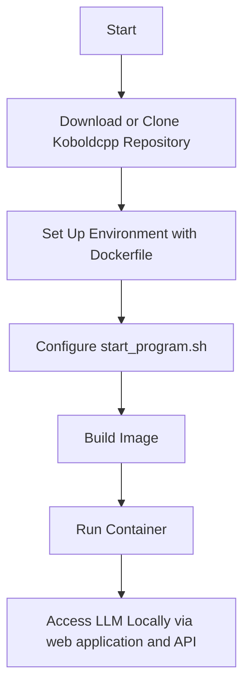

# Running a Local Large Language Model with Docker

This guide will walk you through running a local large language model (LLM) using Docker. We'll use the Koboldcpp repository, a lightweight and efficient LLM runner.

<!-- more -->


## Prerequisites

!!! tip "Requirements"
    - **Docker**: Ensure Docker is installed and running on your system.
    - **Git**: Required for cloning repositories.
    - **Internet access**: To download the required model file within the model build.

## Dockerfile Explanation

The Dockerfile below sets up an environment to run Koboldcpp and the Erosumika-7B model.

```dockerfile
FROM ubuntu:latest # (1)!

# (2)!
RUN apt-get update && apt-get install -y  \ 
    sudo \
    python3-pip \
    gfortran \
    gcc \
    git \
    curl \
    wget

# (3)!
WORKDIR /
RUN mkdir ./home/koboldcpp_dir
COPY ./koboldcpp_dir ./home/koboldcpp_dir

# (4)!
WORKDIR /home/koboldcpp_dir/models
RUN wget --no-check-certificate -O Erosumika-7B-v3-0.2-Q4_K_M-imat.gguf "https://huggingface.co/Lewdiculous/Erosumika-7B-v3-0.2-GGUF-IQ-Imatrix/resolve/main/Erosumika-7B-v3-0.2-Q4_K_M-imat.gguf?download=true"

# (5)!
WORKDIR /
WORKDIR /home/koboldcpp_dir
RUN make

# (6)!
WORKDIR /
COPY ./start_program.sh /home/koboldcpp_dir
WORKDIR /home/koboldcpp_dir
RUN chmod 555 start_program.sh

# (7)!
EXPOSE 5001

CMD "./start_program.sh"
```

1. We have chosen the latest ubuntu base image
2. Installing some core dependencies for the ubuntu environment
3. Copying over the koboldcpp repository files
4. Setting the working directory to the models directory of koboldcpp and downloading a model from Huggingface
5. Setting the working directory to koboldcpp and running the 'make' command to compile the entire build
6. Copying over the start_program.sh bash script into the koboldcpp directory and granting it privilege to run
7. Exposing the necessary port, whereby the web application and API can be accessed.

## Workflow Diagram

Below is a high-level workflow of how the container is set up and executed:



## Steps to Execute

**Clone the koboldcpp Repository**

Within your project directory, run this command to clone the repository into a folder called koboldcpp_dir. Alternatively, you can also download the latest code release and place it in a similarly named folder.

```bash
git clone https://github.com/LostRuins/koboldcpp koboldcpp_dir
```

**Prepare the start_program.sh bash script**

Within your project directory, create a file called start_program.sh, which will contain your runtime commands for running koboldcpp within your container. You may customize this with various options as specified in the koboldcpp docs. 

Example
```bash
python3 koboldcpp.py \
--contextsize 4096 \
--threads 8 \
--model ./models/Erosumika-7B-v3-0.2-Q4_K_M-imat.gguf
```


**Build  the Docker Image**

Build the Docker image using the Dockerfile provided:

```bash
docker build -t koboldcpp-image .
```

This step can take a few minutes depending on your internet speed and computer performance, as all the project dependencies, including the GGUF model takes place here. When you attempt to re-build the same image, Docker will cache all the un-edited commands, so the longer wait should only be on the first build for most use cases.

**Run the Container**

Execute the following command to start the container:

```bash
docker run --name koboldcpp-container -p 5001:5001 koboldcpp-image
```

A Successful Run of the Docker container 


**Access the LLM**

Open your browser and navigate to `http://localhost:5001` to interact with the LLM or visit `http://localhost:5001/api` to interact with the Swagger docs for the API backend.

The KoboldCPP UI


The KoboldCPP API Docs (Swagger


## Tips and Notes

!!! tip "Optimizations"
    - Use a GPU-enabled environment for faster inference (requires additional setup).

!!! info "Model Format"
    The Erosumika-7B-v3-0.2-Q4_K_M model is stored in GGUF format, optimized for Koboldcpp.


---

With this setup, you should have a functional environment to run a large language model locally using Docker and Koboldcpp. Happy experimenting!

