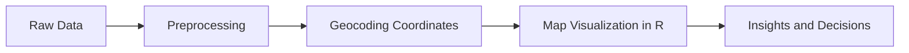

# The Power of Map Visualization in R

Map visualization is a transformative approach for analyzing and communicating geographic data insights. By representing complex datasets visually, maps enable us to discern patterns and relationships that might be challenging to identify otherwise. This article delves into the immense potential of map visualization in R, detailing the prerequisites for creating maps, exploring essential packages such as `leaflet` and `ggplot2`, and providing a practical example to bring these concepts to life.

<!-- more -->

---

## The Power of Map Visualization

Map visualization transcends traditional data representation methods, offering an intuitive and impactful way to communicate insights. It provides:

### Revealing Patterns and Trends
Geographic data often holds hidden patterns that can emerge when visualized spatially. For instance, maps can identify:

- **Hotspots**: Areas with high concentrations of a specific variable, such as crime rates or sales.
- **Clusters**: Groupings of similar data points, indicating correlations or outliers.

### Enhancing Spatial Understanding
Maps illustrate spatial distributions, allowing:

- **Comparative Analysis**: Understand how variables differ across regions.
- **Interrelationships**: Visualize connections between geographic features and datasets, such as population density and income levels.

### Effective Communication
For non-technical stakeholders, maps serve as an accessible medium to:

- **Simplify Complex Data**: Transform raw numbers into relatable visuals.
- **Support Decision-Making**: Facilitate informed strategies by highlighting actionable insights.

---

## Prerequisites for Map Visualization

To create effective map visualizations in R, certain prerequisites must be met:

### Geographic Coordinates
- **Definition**: Longitude and latitude values pinpoint specific locations on Earth.
- **Formats**: Coordinates can be in decimal degrees (e.g., 25.7617° N, 80.1918° W) or degrees-minutes-seconds.
- **Sources**: Public datasets, GPS devices, or online geocoding APIs.

### Map Shapes (Boundaries)
- **Shapefiles**: Vector data formats containing geometry and attribute information.
- **GeoJSON**: Lightweight, JSON-based format for encoding geographic data.
- **Where to Find**: Resources such as [Natural Earth](https://www.naturalearthdata.com/) and the [US Census Bureau](https://www.census.gov/geographies/mapping-files.html) offer downloadable boundary files.

---

## Popular R Packages for Map Visualization

R offers a variety of packages for crafting visually appealing and interactive maps:

### Leaflet
- **Overview**: An interface to the JavaScript Leaflet library for creating interactive web maps.
- **Features**:
  - Add markers, pop-ups, and overlays.
  - Incorporate custom tile layers and legends.
- **Best Use**: Real-time interactivity for web-based map applications.

### Ggplot2
- **Overview**: A cornerstone of data visualization in R, based on the grammar of graphics.
- **Capabilities**:
  - Integrate maps with other data visualizations.
  - Customize projections, themes, and layers.
- **Best Use**: Static or publication-ready maps.

### Other Packages
- **Mapview**: Quick, interactive map rendering.
- **Tmap**: Thematic maps with a focus on layout customization.
- **Plotly**: Interactive 3D and multi-layered visualizations.

---

## Example: Visualizing Crime Rates in Miami

To demonstrate the capabilities of map visualization in R, we will create an interactive map showcasing crime rates across Miami neighborhoods using `leaflet`.

### Step 1: Load Required Libraries and Data
```r
# Install necessary packages if not already installed
if (!require("leaflet")) install.packages("leaflet")
if (!require("dplyr")) install.packages("dplyr")

# Load libraries
library(leaflet)
library(dplyr)

# Load sample dataset
crime_rates <- read.csv("crime_rates.csv")
```

### Step 2: Create the Map
```r
# Generate an interactive map
leaflet(data = crime_rates) %>%
  addTiles() %>%
  addCircles(
    lng = ~longitude, lat = ~latitude,
    radius = ~crime_rate * 1000,
    color = "red", fillOpacity = 0.5
  ) %>%
  addLegend(
    position = "bottomright",
    pal = colorNumeric(palette = "Reds", domain = crime_rates$crime_rate),
    values = crime_rates$crime_rate,
    title = "Crime Rate"
  )
```

### Explanation
- **`addCircles`**: Visualizes crime rates with circle sizes proportional to their values.
- **`addLegend`**: Provides a color-coded legend for interpretation.

---

## Advanced Techniques

### Incorporating Projections
Using `ggplot2` with the `sf` package, you can apply advanced map projections:
```r
library(ggplot2)
library(sf)

# Load shapefile and join data
miami_shapefile <- st_read("miami_shapefile.shp")
crime_data <- miami_shapefile %>% left_join(crime_rates, by = "region")

# Plot map
ggplot(data = crime_data) +
  geom_sf(aes(fill = crime_rate)) +
  scale_fill_viridis_c(option = "C") +
  theme_minimal() +
  labs(title = "Crime Rates in Miami", fill = "Crime Rate")
```

### Using Mermaid Diagrams
Visualize workflows or processes using Mermaid syntax:



---

## Conclusion

Map visualization in R is an indispensable tool for uncovering and presenting geographic insights. With powerful libraries such as `leaflet` and `ggplot2`, analysts can craft dynamic and insightful maps tailored to diverse applications. Whether communicating to technical teams or broad audiences, map visualizations bridge the gap between data and understanding, empowering data-driven decisions.
