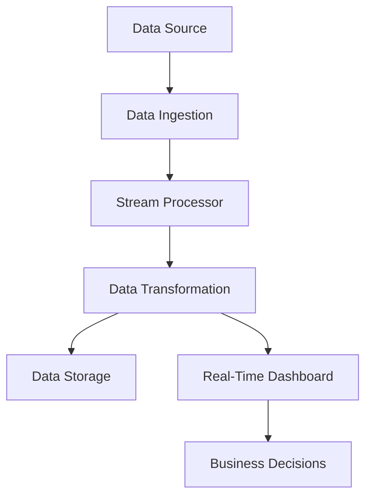

# **In-Real-Time Data Syncing and Processing: Unlocking Reproducible Workflows**

In today's fast-paced, data-driven world, the ability to process and sync data in real-time is not just a luxury but a necessity for making informed and timely decisions. As data continues to grow in volume, variety, and velocity, traditional batch-processing methods are increasingly inadequate. Real-time data syncing and processing offer the scalability, speed, and reliability that modern organizations require to stay competitive and responsive.

**The Importance of Reproducible Workflows**
--------------------------------------------

Reproducible workflows form the backbone of robust and reliable data analysis. They ensure that data processing pipelines are consistent, repeatable, and transparent, enabling trust in the insights derived. The importance of reproducibility extends beyond accuracy; it encompasses accountability and the ability to debug, improve, and share workflows seamlessly.

### Key Components of Reproducible Workflows

* **Containerization:**
  Using containers, such as Docker, to package data processing applications with their dependencies ensures consistent execution across various environments. This eliminates discrepancies caused by environment-specific configurations.

* **Big Data Technologies:**
  Leveraging frameworks like Hadoop, Spark, and NoSQL databases allows organizations to handle massive volumes of structured and unstructured data. These technologies support parallel processing, enabling the analysis of large datasets efficiently.

* **Error Reporting and Logging:**
  Implementing robust error reporting mechanisms, such as logging frameworks and monitoring tools, helps detect, track, and resolve data processing errors promptly. Centralized logging systems like ELK (Elasticsearch, Logstash, and Kibana) enhance traceability and analysis.

* **ETL Pipelines:**
  Efficient ETL (Extract, Transform, Load) pipelines streamline the flow of data from disparate sources into actionable insights. Automating ETL processes minimizes manual intervention and ensures consistency.

**In-Real-Time Data Syncing and Processing**
--------------------------------------------

In-real-time data syncing and processing involve the continuous collection, integration, and transformation of data as it is generated. This approach empowers organizations to maintain up-to-date datasets and gain insights in near real-time.

### Key Benefits

* **Agility in Decision-Making:**
  By processing data as it arrives, organizations can adapt quickly to evolving trends, such as changes in customer preferences or market conditions.

* **Improved Data Accuracy:**
  Continuous syncing minimizes the latency between data generation and analysis, ensuring the data remains current and accurate.

* **Enhanced Operational Efficiency:**
  Automated real-time systems reduce the need for manual interventions, freeing up resources for other critical tasks.

**Technologies for In-Real-Time Data Syncing and Processing**
------------------------------------------------------------

Several cutting-edge technologies power real-time data workflows, each suited for specific use cases:

* **Apache Kafka:**
  A distributed streaming platform designed for high-throughput, fault-tolerant messaging. Kafka excels in use cases requiring event streaming, such as log aggregation, real-time analytics, and microservices communication.

* **Apache Spark:**
  Known for its in-memory data processing capabilities, Spark is ideal for batch and stream processing. Its structured streaming API allows developers to build scalable real-time applications.

* **Apache Flink:**
  A high-performance platform for distributed stream and batch processing. Flink provides low-latency data processing and is particularly suited for stateful stream processing.

**Best Practices for Implementing In-Real-Time Data Syncing and Processing**
----------------------------------------------------------------------------

Achieving an effective real-time data pipeline requires meticulous planning and execution. Below are some best practices:

### Design Considerations

* **Pipeline Monitoring and Optimization:**
  Use monitoring tools like Prometheus and Grafana to track pipeline performance. Regularly identify bottlenecks and optimize for efficiency.

* **Error Handling:**
  Implement retry mechanisms, dead-letter queues, and alerting systems to ensure errors are logged and addressed promptly.

* **Scalability:**
  Architect pipelines to handle growth in data volume and velocity. Employ cloud-native services for elastic scaling as needed.

### Deployment Practices

* **Containerization:**
  Package applications using Docker and orchestrate them with Kubernetes for easy deployment, scaling, and management.

* **Data Security and Governance:**
  Apply encryption, access control, and data anonymization techniques to comply with regulations like GDPR or HIPAA.

### Performance Metrics

Regularly track key performance indicators (KPIs), such as:

* **Latency:** Time taken for data to travel from generation to processing.
* **Throughput:** Volume of data processed within a given time frame.
* **Error Rates:** Frequency of processing errors or failures.

**Visualization: Real-Time Data Workflow**
------------------------------------------

Below is a simplified Mermaid diagram representing a real-time data pipeline:

**Conclusion**
--------------

In-real-time data syncing and processing unlock the potential of modern organizations to remain agile and data-driven. By implementing reproducible workflows and leveraging advanced technologies like Kafka, Spark, and Flink, businesses can process massive data volumes efficiently and reliably. Adhering to best practices, such as robust error handling, scalability, and monitoring, ensures the success of real-time data initiatives. With these tools and strategies, organizations can harness the full power of their data, driving innovation and maintaining a competitive edge in a rapidly changing world.
