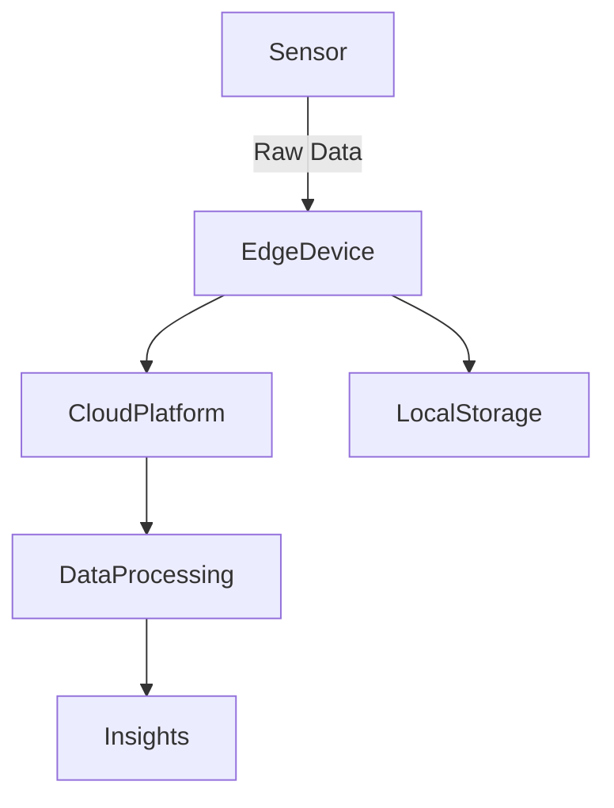

# Building a Sensor Data Application: A Comprehensive Guide

## Introduction

The world of technology is rapidly evolving, and one of the most significant advancements in recent years is the proliferation of sensors. Sensors are devices that detect and measure physical parameters, such as temperature, humidity, pressure, and motion, and convert them into digital signals. These digital signals can then be processed, analyzed, and visualized to gain valuable insights. 

In this article, we will explore the process of building a sensor data application, delving into the basics of sensors, data transfer, processing, and visualization. By the end, you'll have a detailed understanding of how to architect a robust and scalable sensor data system.

## What is a Sensor?

A **sensor** is a device that detects and measures physical parameters, such as:

- Temperature
- Humidity
- Pressure
- Motion
- Light
- Sound

### Types of Sensors

Sensors can be categorized into two main types:

1. **Analog Sensors**: These sensors produce a continuous signal proportional to the measured parameter. Examples include:
   - **Temperature sensors**: Thermocouples, thermistors.
   - **Pressure sensors**: Strain gauges.

2. **Digital Sensors**: These sensors produce discrete signals representing the measured parameter. Examples include:
   - **Motion sensors**: Passive infrared (PIR) sensors.
   - **Proximity sensors**: Ultrasonic sensors.

---

## Transferring Data from a Sensor to a Digital Environment

Once a sensor has detected and measured a physical parameter, the data must be transferred to a digital environment for processing and analysis. This can be achieved through various methods:

### Wired Connections

- **USB and Serial**: Reliable and commonly used for direct sensor-to-device communication.
- **I2C and SPI**: Protocols for connecting multiple sensors to microcontrollers.

### Wireless Connections

- **Bluetooth**: Ideal for short-range, low-power applications.
- **Wi-Fi**: Suitable for high-data-rate transfers in local networks.
- **Zigbee**: Low-power, low-data-rate, and ideal for mesh networks.

### Cloud Connectivity

- **AWS IoT**: Provides a managed cloud platform to securely connect sensors and devices.
- **Google Cloud IoT Core**: Enables global-scale data ingestion and analysis.

### Considerations for Data Transfer

- **Latency**: Minimize delays to ensure real-time processing.
- **Bandwidth**: Account for the volume of data generated.
- **Security**: Encrypt data during transfer to prevent breaches.

---

## Processing Sensor Data

Once the sensor data is transferred to a digital environment, it undergoes processing to extract meaningful insights. This step includes:

### Data Filtering

- **Noise Reduction**: Use algorithms like moving averages or Kalman filters to remove unwanted signals.

### Data Transformation

- Convert raw sensor readings into meaningful units (e.g., voltage to temperature).
- Normalize data to ensure compatibility across systems.

### Data Aggregation

- Combine data from multiple sensors to:
  - Monitor trends.
  - Detect anomalies.
  - Correlate related metrics.

### Advanced Processing Techniques

- **Machine Learning**: Train models to predict outcomes based on historical sensor data.
- **Edge Processing**: Perform computations locally on IoT devices to reduce cloud dependence.

---

## Visualizing, Summarizing, and Delivering Processed Sensor Data

The final step in building a sensor data application is to visualize, summarize, and deliver the processed data to stakeholders. This can be achieved through:

### Data Visualization

- **Dashboards**: Tools like Grafana or Tableau for real-time monitoring.
- **Graphs and Charts**: Line graphs for trends, pie charts for distributions.

### Summary Reports

- Automated generation of reports highlighting key findings.
- Include metrics, thresholds, and historical comparisons.

### Alerts and Notifications

- **Threshold Alerts**: Notify stakeholders when values exceed predefined limits.
- **Predictive Alerts**: Use machine learning to predict and warn of potential issues.

---

## Example Use Cases

### Industrial Automation

- **Sensors**: Monitor temperature, pressure, and vibration in machinery.
- **Outcome**: Predictive maintenance to reduce downtime.

### Smart Homes

- **Sensors**: Track humidity, lighting, and occupancy.
- **Outcome**: Optimize energy consumption and improve comfort.

### Healthcare

- **Sensors**: Monitor heart rate, blood pressure, and glucose levels.
- **Outcome**: Enhance patient care and provide early warnings for medical issues.

---

## Next Steps

1. **Explore Sensor Options**:
   - Research and select sensors for your specific use case.

2. **Develop a Data Transfer Strategy**:
   - Decide between wired and wireless methods based on requirements.

3. **Design a Data Processing Pipeline**:
   - Create workflows for filtering, transforming, and aggregating data.

4. **Visualize and Summarize Data**:
   - Use tools and techniques to generate insights and actionable information.

---

## Conclusion

Building a sensor data application is a complex but rewarding process. It involves integrating hardware and software to create systems capable of delivering actionable insights. By following the steps outlined in this guide, you can build applications that leverage the power of sensors to drive innovation, efficiency, and decision-making in various fields.
