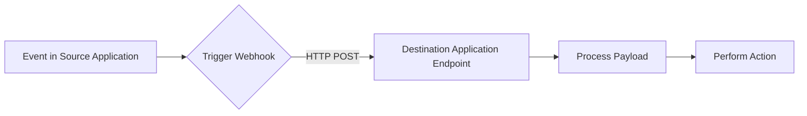

# **Setting Up a Webhook Programmatically**


### Introduction

Webhooks are a powerful tool for integrating different applications and services, enabling real-time notifications and automation. In this article, we'll delve into the world of webhooks, exploring how to set them up programmatically for popular platforms like MS Teams and Discord. We'll also cover the theory behind webhooks, discuss security considerations, and provide examples of open-source code for securing credentials.

<!-- more -->


### What is a Webhook?

A webhook is essentially a callback function that's triggered by a specific event. It's a way for an application to notify another application of an event, allowing them to take action in response. Webhooks are commonly used for tasks like sending notifications, updating records, or triggering workflows.

### Anatomy of a Webhook

#### Components of a Webhook
1. **Trigger Event**: The specific event that causes the webhook to execute. Examples include a user signing up or a file being uploaded.
2. **Endpoint URL**: The destination URL where the webhook sends the HTTP request.
3. **Payload**: The data transmitted with the HTTP request, often in JSON format.
4. **Headers**: Metadata about the request, such as authentication tokens or content types.

#### Workflow Diagram


### Setting Up a Webhook Programmatically

#### MS Teams

To set up a webhook in MS Teams, you'll need to create a connector and configure it to send notifications to your Teams channel. Here's an example of how to do this using Python:
```python
import requests

# Replace with your Teams channel URL
teams_url = "https://your-teams-channel-url"

# Set up the webhook payload
payload = {
    "@type": "MessageCard",
    "@context": "https://schema.org/extensions",
    "title": "Webhook Notification",
    "text": "This is a test notification"
}

# Set up the webhook headers
headers = {
    "Content-Type": "application/json"
}

# Send the webhook request
response = requests.post(teams_url, json=payload, headers=headers)

# Check if the request was successful
if response.status_code == 200:
    print("Webhook sent successfully")
else:
    print("Error sending webhook:", response.text)
```

#### Discord

To set up a webhook in Discord, you'll need to create a webhook on your Discord server and configure it to send notifications to your channel. Here's an example of how to do this using Python:
```python
import requests

# Replace with your Discord webhook URL
discord_url = "https://your-discord-webhook-url"

# Set up the webhook payload
payload = {
    "content": "This is a test notification"
}

# Set up the webhook headers
headers = {
    "Content-Type": "application/json"
}

# Send the webhook request
response = requests.post(discord_url, json=payload, headers=headers)

# Check if the request was successful
if response.status_code == 200:
    print("Webhook sent successfully")
else:
    print("Error sending webhook:", response.text)
```

#### Others

Other platforms, such as Slack and GitHub, also support webhooks. The process for setting up a webhook on these platforms is similar to the examples above, with the main difference being the specific API endpoint and payload format.

### Theory and Understanding Behind Webhooks

Webhooks are based on the concept of a callback function, which is a function that's passed as an argument to another function. In the case of webhooks, the callback function is triggered by a specific event, such as a new message being posted to a channel.

When a webhook is triggered, the source application sends an HTTP request to the destination application, which then processes the request and takes action accordingly. This allows for real-time notifications and automation, enabling applications to respond quickly to changing conditions.

#### Advantages of Webhooks
- **Real-Time Communication**: Instantaneous data transfer between systems.
- **Efficiency**: Reduces polling overhead and conserves resources.
- **Scalability**: Adapts well to growing system demands.

#### Challenges of Webhooks
- **Security Risks**: Exposure of sensitive endpoints.
- **Error Handling**: Requires robust failure recovery mechanisms.

### Securing Credentials with Open-Source Code

When working with webhooks, it's essential to secure your credentials to prevent unauthorized access. One way to do this is to use environment variables or a secrets manager to store your credentials.

Here's an example of how to use the `python-dotenv` library to load environment variables from a `.env` file:
```python
import os
from dotenv import load_dotenv

# Load environment variables from .env file
load_dotenv()

# Get the webhook URL from the environment variable
webhook_url = os.getenv("WEBHOOK_URL")

# Use the webhook URL to send the request
response = requests.post(webhook_url, json=payload, headers=headers)
```

By storing your credentials securely and using open-source code to manage them, you can ensure that your webhooks are secure and reliable.

### Best Practices for Webhooks

- **Validate Payloads**: Use signature verification to confirm the authenticity of incoming requests.
- **Rate Limiting**: Prevent abuse by limiting the number of requests to your endpoint.
- **Monitoring and Logging**: Maintain detailed logs for debugging and performance optimization.

### Conclusion

In this article, we've explored the world of webhooks, covering how to set them up programmatically for popular platforms like MS Teams and Discord. We've also discussed the theory behind webhooks and provided examples of open-source code for securing credentials. By following these guidelines and best practices, you can create secure and reliable webhooks that enable real-time notifications and automation for your applications.

---
