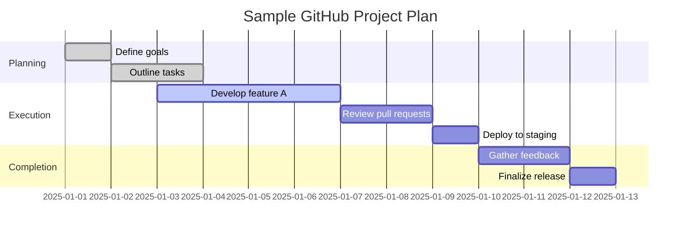

# Effective Project Planning: Leveraging Social Media and Specialized Tools

In today's fast-paced tech landscape, efficient project planning is crucial for success. With numerous tools and platforms available, it can be overwhelming to choose the right ones for your needs. In this article, we'll explore the benefits of leveraging social media and project planning tools, focusing on GitHub Projects, enterprise-level tools, and custom frameworks.

<!-- more -->

---

## **Understanding Project Planning**

Project planning is the foundation of any successful initiative. It involves defining objectives, allocating resources, and creating a roadmap for execution. Effective planning ensures:

- **Clarity**: Team members understand their roles and responsibilities.
- **Efficiency**: Resources are utilized optimally, reducing waste.
- **Accountability**: Progress can be tracked and measured against milestones.

Project planning in the digital age demands tools that cater to diverse needs, from simple task tracking to complex workflows involving multiple teams.

### **Leveraging Social Media in Project Planning**

Social media platforms offer a unique advantage for project planning and collaboration. These tools can be used for:

- **Communication**: Platforms like Slack and Discord enable real-time team interactions.
- **Promotion**: LinkedIn and Twitter help in sharing project updates and engaging stakeholders.
- **Networking**: Building relationships with potential collaborators or clients.

Social media's ubiquity makes it an essential supplement to dedicated project management tools.

---

## **GitHub Projects: A Developer's Best Friend**

GitHub Projects is a powerful tool for managing and tracking progress on your projects. As part of the GitHub ecosystem, it seamlessly integrates with your repositories, issues, and pull requests. 

### **Features and Benefits**

With GitHub Projects, you can:

- **Visualize Workflows**: Use Kanban-style boards to track progress.
- **Streamline Tasks**: Assign tasks and monitor their status directly within the repository.
- **Set Deadlines**: Incorporate reminders to keep the team on track.
- **Foster Collaboration**: Enable discussions and feedback loops with stakeholders.

#### **Example Workflow**

GitHub Projects is ideal for open-source projects, personal initiatives, or small teams. Its flexibility and customization options make it an excellent choice for developers and project managers alike.

---

## **Enterprise-Level Tools: Streamlining Complex Projects**

For larger organizations or complex projects, enterprise-level tools offer advanced features and scalability. These tools cater to diverse industries and team dynamics, ensuring effective management.

### **Popular Enterprise-Level Tools**

#### **1. Asana**

A comprehensive platform that provides:

- Workflow automation
- Reporting dashboards
- Integration with tools like Slack and Google Drive

#### **2. Trello**

Known for its simplicity and visual appeal:

- Boards, lists, and cards for task tracking
- Power-ups for added functionality
- User-friendly interface

#### **3. Jira**

Designed for software development and IT teams:

- Agile methodologies support (Scrum and Kanban)
- Advanced reporting and analytics
- Integration with CI/CD pipelines

### **Benefits of Enterprise Tools**

- **Scalability**: Handle projects of any size.
- **Customization**: Adapt to specific workflows.
- **Security**: Ensure data protection with robust measures.

---

## **Custom Frameworks: Hosting Your Own Solution**

When off-the-shelf solutions fall short, custom frameworks offer a tailored approach. Organizations can design bespoke tools to meet unique requirements.

### **Advantages of Custom Frameworks**

1. **Flexibility**: Adaptable to specific workflows.
2. **Security**: Maintain strict control over sensitive data.
3. **Cost-effectiveness**: Avoid recurring subscription fees.

### **Challenges to Consider**

- **Development Time**: Building a custom framework requires significant effort.
- **Maintenance**: Ongoing updates and bug fixes demand resources.
- **Expertise**: Requires skilled personnel to design and manage the solution.

---

## **Choosing the Right Tool**

Selecting a project planning tool involves:

1. **Assessing Needs**: Identify team size, project complexity, and desired features.
2. **Trial and Error**: Leverage free trials or demos to test functionality.
3. **Scalability**: Ensure the tool can grow with your organization's needs.

---

## **Conclusion**

Effective project planning is essential for delivering successful projects on time and within budget. By leveraging tools like GitHub Projects, enterprise-level platforms, or custom frameworks, teams can streamline workflows, enhance collaboration, and achieve their goals.

Whether you're a developer, project manager, or entrepreneur, the right project planning tool can make a significant difference. Explore these options, evaluate their features, and choose the combination that aligns with your organizational needs. Empower your team with the right tools to navigate the complexities of modern project management.
