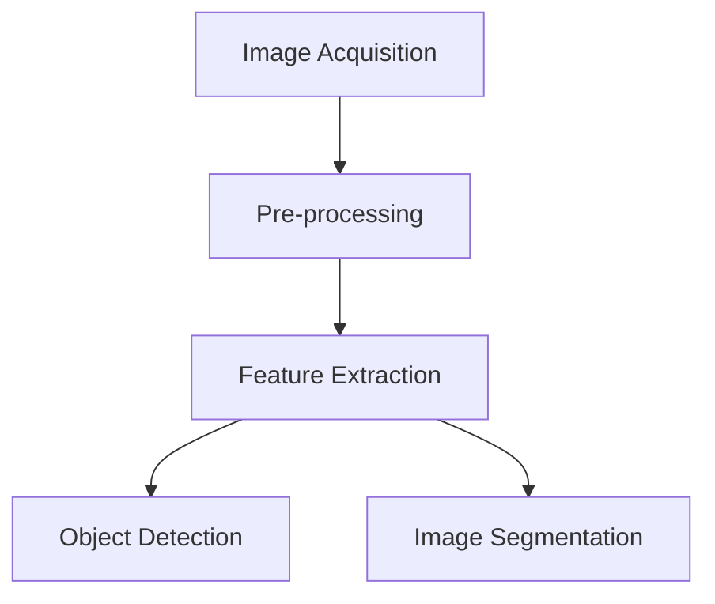

# **Vision Processing: Unlocking the Power of Image Analysis**

Vision processing, also known as computer vision, is a field of artificial intelligence that enables computers to interpret and understand visual information from the world. With the rapid advancement of technology, vision processing has become a crucial aspect of various industries, including healthcare, security, transportation, and more. In this article, we will delve into the fundamentals of vision processing, explore its applications, and discuss the current state of APIs and providers in 2025.

<!-- more -->

### Fundamentals of Vision Processing

Vision processing involves the use of algorithms and statistical models to process and analyze visual data from images and videos. The process typically consists of the following steps:

1. **Image Acquisition**: Capturing images or videos using cameras or other devices.
2. **Pre-processing**: Enhancing or filtering the image to remove noise or irrelevant information.
3. **Feature Extraction**: Identifying and extracting relevant features from the image, such as edges, shapes, or textures.
4. **Object Detection**: Identifying and classifying objects within the image.
5. **Image Segmentation**: Dividing the image into its constituent parts or objects.

Some of the key algorithms used in vision processing include:

* **Convolutional Neural Networks (CNNs)**: A type of deep learning algorithm that excels at image classification and object detection tasks.
* **Thresholding**: A technique used to separate objects from the background by applying a threshold value to the image.
* **Edge Detection**: A method used to identify the boundaries of objects within an image.

#### Annotated Diagram of Vision Processing Workflow



The diagram above outlines a typical workflow in vision processing, from capturing an image to analyzing its components.

### APIs and Providers

In 2025, there are numerous APIs and providers that offer vision processing capabilities, including:

* **Google Cloud Vision API**: A cloud-based API that provides image analysis and recognition capabilities.
* **Amazon Rekognition**: A deep learning-based image analysis service that can identify objects, people, and text within images.
* **Microsoft Azure Computer Vision**: A cloud-based API that provides image analysis and recognition capabilities, including object detection and image classification.
* **OpenCV**: An open-source computer vision library that provides a wide range of vision processing algorithms and tools.

#### Feature Comparison Table

| API/Provider              | Features                                         | Pricing Model        | Best Use Case                          |
|---------------------------|-------------------------------------------------|----------------------|----------------------------------------|
| Google Cloud Vision API   | Image recognition, OCR, label detection         | Pay-as-you-go        | General-purpose applications           |
| Amazon Rekognition        | Face detection, object tracking, custom labels  | Tiered pricing       | Security and surveillance systems      |
| Microsoft Azure Computer Vision | Optical character recognition, content moderation | Subscription or usage-based | Enterprise-level integrations         |
| OpenCV                    | Edge detection, template matching, real-time processing | Free                | Research and custom application development |

### Applications in Today's World (2025)

Vision processing has numerous applications in various industries, including:

* **Healthcare**: Vision processing is used in medical imaging analysis, such as tumor detection and diagnosis. For example, convolutional neural networks (CNNs) are employed to identify abnormalities in X-rays and MRIs.
* **Security**: Vision processing is used in surveillance systems to detect and recognize individuals, as well as to monitor suspicious activity. Real-time face recognition algorithms enable faster and more accurate identification.
* **Transportation**: Vision processing is used in autonomous vehicles to detect and respond to objects on the road. This includes tasks like lane detection, obstacle avoidance, and traffic sign recognition.
* **Retail**: Vision processing is used in inventory management and product recognition systems. Smart checkout systems utilize object detection to automate billing processes.
* **Smart Homes**: Vision processing is used in home security systems and smart appliances to detect and respond to user interactions. For instance, cameras in smart doorbells can identify visitors and send alerts to homeowners.

### Scripting for Vision Processing

To get started with vision processing, you can use programming languages such as Python, Java, or C++. Some popular libraries and frameworks for vision processing include:

* **OpenCV**: A comprehensive library of vision processing algorithms and tools.
* **PyTorch**: A deep learning framework that provides pre-built vision processing models and tools.
* **TensorFlow**: A deep learning framework that provides pre-built vision processing models and tools.

#### Example Code: Face Detection with OpenCV

Here is an example code snippet in Python using OpenCV to detect faces in an image:

```python
import cv2

# Load the image
img = cv2.imread('image.jpg')

# Convert the image to grayscale
gray = cv2.cvtColor(img, cv2.COLOR_BGR2GRAY)

# Load the face detection cascade
face_cascade = cv2.CascadeClassifier('haarcascade_frontalface_default.xml')

# Detect faces in the image
faces = face_cascade.detectMultiScale(gray, 1.1, 4)

# Draw rectangles around the detected faces
for (x, y, w, h) in faces:
    cv2.rectangle(img, (x, y), (x+w, y+h), (0, 255, 0), 2)

# Display the output
cv2.imshow('Faces', img)
cv2.waitKey(0)
cv2.destroyAllWindows()
```

This code snippet detects faces in an image using the Haar cascade classifier and draws rectangles around the detected faces.

#### Further Exploration

You can expand on this script by:

- Integrating a CNN model for more robust face detection.
- Implementing real-time video analysis using a webcam.
- Adding filters to pre-process the image for better accuracy.

### Conclusion

Vision processing is a powerful technology with applications across numerous industries. With advancements in APIs and libraries, it has become more accessible for developers, researchers, and businesses alike. Whether you are automating processes, enhancing security, or building innovative products, vision processing opens up a world of possibilities. By exploring its tools and frameworks, you can harness the full potential of image analysis to create impactful solutions.
