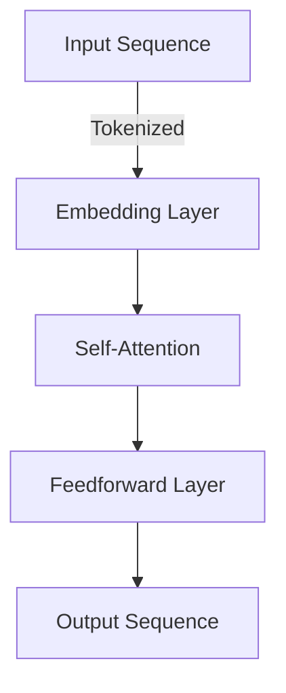

# **Unlocking the Power of Deep Learning: A Dive into Vectors, Semantic Algorithms, and Neural Networks**

Deep learning has revolutionized the field of artificial intelligence, enabling machines to learn and understand complex patterns in data. At the heart of deep learning lies a fundamental concept: vectors. In this article, we'll delve into the world of vectors, semantic algorithms, neural networks, and Large Language Models (LLMs), exploring the latest advancements and techniques in the field.

<!-- more -->

**Vectors: The Building Blocks of Deep Learning**
--------------------------------------------

Vectors are mathematical representations of quantities with both magnitude and direction. In the context of deep learning, vectors are used to represent words, images, and other types of data. These vectors are typically high-dimensional, meaning they have many features or dimensions. For example, a word embedding vector might have 300 dimensions, each representing a specific aspect of the word's meaning.

One of the most popular techniques for creating vector representations of words is Word2Vec. This algorithm uses a neural network to learn vector representations of words based on their context and co-occurrence in a large corpus of text. The resulting vectors can be used for a variety of tasks, such as text classification, sentiment analysis, and topic modeling.

### Expanding Applications of Vectors

Vectors also play a critical role in computer vision and recommendation systems. In image processing, convolutional neural networks (CNNs) transform pixel data into feature vectors that encode patterns such as edges and textures. These representations enable tasks like object detection and image segmentation.

In recommendation systems, vectors are used to represent user preferences and item characteristics. Collaborative filtering methods compute the similarity between these vectors to suggest personalized content. For instance, Netflix and Spotify rely on vector-based embeddings to recommend movies and music.

  
<strong>Note:</strong> Explore interactive tools like <a href="https://projector.tensorflow.org/">TensorFlow Embedding Projector</a> to visualize vector spaces and gain insights into their structure.

**Semantic Algorithms: Understanding Meaning and Context**
---------------------------------------------------

Semantic algorithms are designed to understand the meaning and context of language. These algorithms can be used to perform tasks such as named entity recognition, part-of-speech tagging, and dependency parsing. One of the most popular semantic algorithms is the Transformers model, which uses self-attention mechanisms to weigh the importance of different words in a sentence.

The Transformers model has been widely adopted in the field of natural language processing (NLP) and has achieved state-of-the-art results in a variety of tasks. It's also been used as a foundation for more advanced models, such as BERT and RoBERTa.

### A Deeper Look at Transformers

Transformers have a modular architecture that includes an encoder-decoder structure and attention layers. Self-attention allows the model to capture relationships between words, regardless of their position in the sequence. This capability enables handling long-range dependencies in text.

Mermaid diagram illustrating self-attention:

### Beyond NLP: Multimodal Applications

Semantic algorithms extend beyond text to multimodal data. Vision-language models, such as CLIP and DALL-E, align image and text embeddings in a shared semantic space. These models enable tasks like generating captions for images or creating visuals from textual descriptions.

  
<strong>Tip:</strong> Experiment with pre-trained multimodal models using frameworks like <a href="https://huggingface.co/transformers/">Hugging Face Transformers</a>.

**Neural Networks: The Backbone of Deep Learning**
---------------------------------------------

Neural networks are composed of layers of interconnected nodes or "neurons" that process and transform inputs. These networks can be trained to perform a wide range of tasks, from image classification to speech recognition.

### Types of Neural Networks

- **Convolutional Neural Networks (CNNs):** Specialize in spatial data like images.
- **Recurrent Neural Networks (RNNs):** Handle sequential data and are effective for tasks like time series analysis and machine translation.
- **Transformer Models:** Advanced architecture excelling in NLP and multimodal tasks.

### Training Techniques

Effective training involves:
- **Optimization Algorithms:** Gradient descent and its variants (e.g., Adam, RMSProp).
- **Regularization Methods:** Dropout, weight decay, and batch normalization to prevent overfitting.
- **Data Augmentation:** Techniques like rotation and cropping for robust image models.

**Large Language Models (LLMs): The Future of NLP**
---------------------------------------------

LLMs are a type of neural network designed specifically for natural language processing tasks. These models are trained on vast amounts of text data and can be fine-tuned for specific tasks, such as language translation or text summarization.

### Scaling LLMs

The performance of LLMs scales with:
- **Model Size:** Larger architectures like GPT-4 and PaLM have billions of parameters.
- **Training Data:** Diverse datasets improve generalization.
- **Compute Resources:** High-performance GPUs and TPUs enable efficient training.

  
<strong>Warning:</strong> Large-scale models can have significant environmental costs. Research into energy-efficient AI is crucial for sustainable development.

### Advanced Techniques: Prompt Engineering and Few-Shot Learning

Prompt engineering involves crafting inputs to guide the model's behavior effectively. Few-shot learning uses minimal examples to adapt the model to new tasks. These techniques enable rapid deployment without extensive fine-tuning.

**Conclusion**
----------

Deep learning has come a long way in recent years, and the latest advancements in vectors, semantic algorithms, neural networks, and LLMs are poised to take the field to new heights. Whether you're a seasoned researcher or just starting out, there's never been a more exciting time to explore the world of deep learning. With the right tools and techniques, you can unlock the full potential of these powerful models and create innovative solutions that transform industries and improve lives.

---

  
For further reading, visit the <a href="https://arxiv.org/">arXiv</a> repository for cutting-edge research papers.

