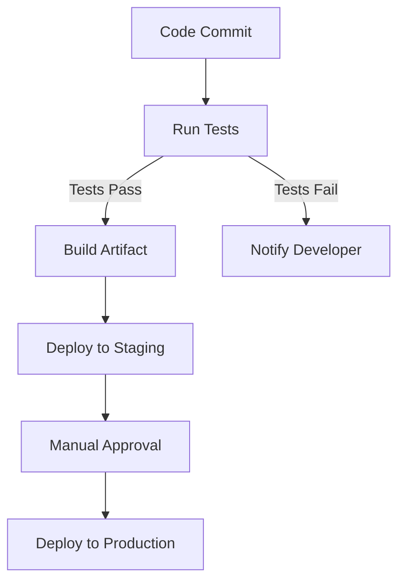

# **Best Practices for Software Developers: Elevating Your Craft**

As a software developer, adhering to best practices is crucial for delivering high-quality solutions that meet the needs of users and stakeholders. In this article, we'll explore the essential principles for backend, frontend, middleware, full stack, data strategy, DevOps, documentation, and scripting. By embracing these best practices, you'll be well on your way to crafting exceptional software that drives success.

<!-- more -->

---

### **Backend Development Best Practices**

Backend development is the backbone of any software system. Following these practices ensures that your backend is robust, scalable, and maintainable:

1. **Separation of Concerns**: 
   - Use layered architectures (e.g., MVC) to separate responsibilities. 
   - Benefits include enhanced testability and reduced code coupling.

2. **API-First Development**: 
   - Prioritize designing APIs before implementing functionality.
   - Tools: Swagger/OpenAPI for API design and documentation.

3. **Database Modeling**:
   - Normalize data to avoid redundancy but denormalize selectively for performance.
   - Regularly review schema for optimization opportunities.

4. **Error Handling**: 
   - Use structured error objects with clear status codes (e.g., 400 for bad requests, 500 for server errors).
   - Implement retry mechanisms for transient errors.

---

### **Frontend Development Best Practices**

Frontend is the face of your application, and these practices ensure a polished user experience:

1. **User-Centered Design**: 
   - Conduct usability testing and gather user feedback early and often.
   - Tools: Figma, Adobe XD for prototyping and testing.

2. **Modular Code**: 
   - Leverage component-based libraries/frameworks like React or Vue.js.
   - Establish a shared design system for consistency.

3. **Accessibility**: 
   - Follow WCAG guidelines to make the app usable for all users.
   - Use ARIA roles and semantic HTML tags appropriately.

4. **Performance Optimization**:
   - Implement lazy loading, minimize DOM manipulation, and leverage CDNs.
   - Tools: Lighthouse, WebPageTest for performance auditing.

---

### **Middleware and Full Stack Best Practices**

Middleware connects frontend and backend components seamlessly, and full-stack development requires attention to both:

1. **Service-Oriented Architecture**:
   - Decouple services to enhance flexibility and fault isolation.
   - Example: A payment service independent of the user service.

2. **Microservices**:
   - Break down monolithic systems, but manage inter-service communication carefully.
   - Tools: Kubernetes, Docker for containerized deployments.

3. **API Gateway**:
   - Centralize API management for security, caching, and rate limiting.
   - Tools: Kong, Amazon API Gateway.

4. **Monitoring and Logging**:
   - Use distributed tracing to track requests across services.
   - Tools: ELK Stack, Prometheus, and Grafana.

---

### **Data Strategy Best Practices**

A solid data strategy is the foundation for making informed decisions and maintaining trust:

1. **Data Modeling**:
   - Create entity-relationship diagrams (ERDs) to map relationships.
   - Regularly update models as business needs evolve.

2. **Data Governance**:
   - Implement role-based access control (RBAC) for sensitive data.
   - Establish auditing mechanisms to track data changes.

3. **Data Warehousing**:
   - Opt for a modern data stack combining ETL tools with cloud-based warehouses like Snowflake or BigQuery.
   - Focus on dimensional modeling for analytical queries.

4. **Data Security**:
   - Encrypt data at rest and in transit.
   - Conduct regular vulnerability assessments.

---

### **DevOps Best Practices**

DevOps bridges the gap between development and operations, emphasizing automation and continuous improvement:

1. **Continuous Integration**:
   - Set up automated pipelines for testing and integration.
   - Tools: Jenkins, GitHub Actions, GitLab CI/CD.

2. **Continuous Deployment**:
   - Employ blue-green or canary deployments to reduce risk.
   - Automate rollbacks for failed releases.

3. **Infrastructure as Code (IaC)**:
   - Version-control your infrastructure using tools like Terraform or CloudFormation.
   - Use modular templates for reusable configurations.

4. **Monitoring and Feedback**:
   - Deploy proactive monitoring and alerting systems.
   - Tools: New Relic, Datadog for end-to-end visibility.

---

### **Documentation Best Practices**

Good documentation fosters collaboration and long-term success:

1. **Clear and Concise**:
   - Use simple language and avoid jargon where possible.
   - Provide real-world examples for clarity.

2. **Automated Documentation**:
   - Generate API docs from source code comments.
   - Tools: Docusaurus, MkDocs Material.

3. **Code Comments**:
   - Focus on why over what to provide meaningful context.
   - Example:
     ```python
     # Retry the API call in case of a transient failure
     ```

4. **Change Logs**:
   - Maintain versioned release notes.
   - Highlight breaking changes prominently.

---

### **Scripting Best Practices**

Scripts are essential for automating repetitive tasks. Make them robust and reusable:

1. **Idempotent Scripts**:
   - Design scripts so running them multiple times yields the same result.
   - Example: Use conditional checks before creating directories.

2. **Error Handling**:
   - Capture and log errors for post-mortem analysis.
   - Example:
     ```bash
     if ! some_command; then
       echo "Error: some_command failed" >> error.log
     fi
     ```

3. **Code Organization**:
   - Separate configuration from logic using environment variables or config files.
   - Example: `.env` files for environment-specific settings.

4. **Testing**:
   - Write test cases for scripts, particularly those critical to CI/CD pipelines.
   - Tools: ShellCheck for shell script linting.

---

### **Mermaid Diagram: Development Workflow**

Below is a simplified Mermaid diagram representing a CI/CD workflow:



---

By embracing these best practices, software developers can create high-quality solutions that meet the needs of users and stakeholders. Remember to always prioritize user experience, scalability, and maintainability, and to continuously monitor and improve your craft.
