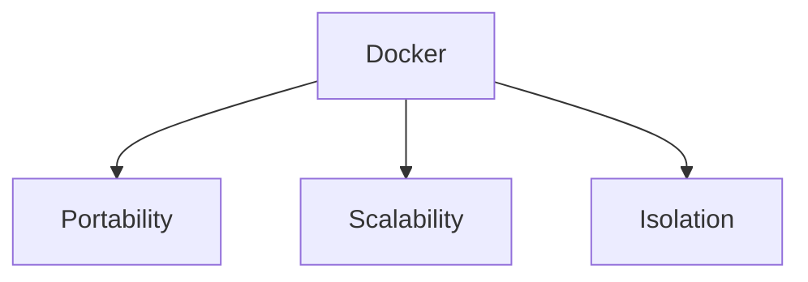
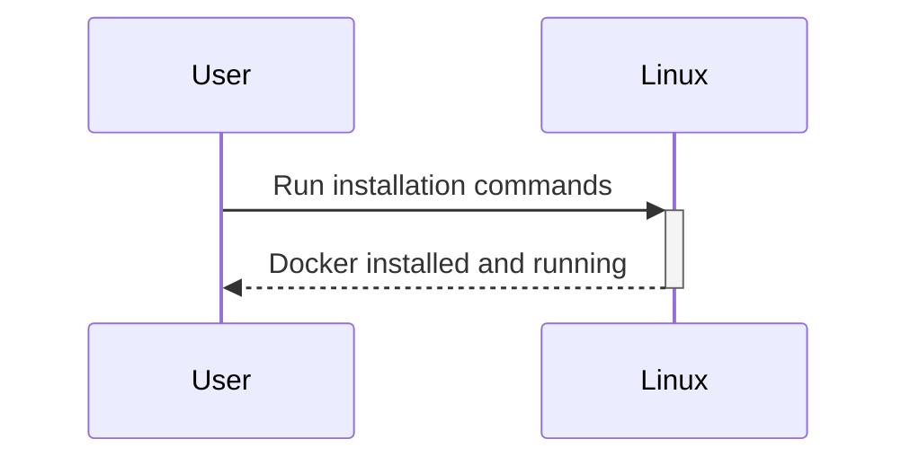
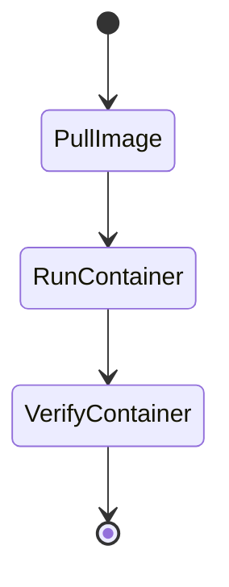

# **Getting Started with Docker: A Beginner's Guide**

Docker has become a cornerstone of modern software development, allowing developers to create, deploy, and run applications in containers. In this guide, we’ll walk you through the basics of Docker to help you kickstart your journey.

<!-- more -->

---

## What is Docker?

Docker is an open-source platform that enables developers to package applications and their dependencies into a portable container. These containers can run consistently across different environments, whether on your local machine, in testing, or in production.

### **Key Benefits**:

| **Benefit**     | **Description**                                                              |
|------------------|------------------------------------------------------------------------------|
| Portability      | "Write once, run anywhere."                                                 |
| Scalability      | Easily deploy and scale applications.                                       |
| Isolation        | Avoid dependency conflicts by isolating environments.                      |



---

## Installing Docker

### **1. Download Docker Desktop**

- [Docker for Windows](https://www.docker.com/products/docker-desktop)
- [Docker for Mac](https://www.docker.com/products/docker-desktop)

### **2. Install on Linux**

```bash
sudo apt update
sudo apt install docker.io
sudo systemctl start docker
sudo systemctl enable docker
```



---

## Understanding Docker Components

Docker consists of several key components that work together to enable containerized development:

| **Component**      | **Purpose**                                                             |
|---------------------|-------------------------------------------------------------------------|
| Docker Engine      | Core service for creating and managing containers.                     |
| Docker CLI         | Command-line interface to interact with Docker.                        |
| Docker Hub         | Repository for sharing and downloading Docker images.                  |
| Docker Compose     | Tool for defining and running multi-container Docker applications.     |


---

## Creating Your First Docker Container

1. **Pull an Image**
   ```bash
   docker pull hello-world
   ```

2. **Run the Container**
   ```bash
   docker run hello-world
   ```

3. **Check Running Containers**
   ```bash
   docker ps
   ```



---

## Tips for Success with Docker

- **Start Small**: Begin with single-container projects before diving into orchestration tools like Kubernetes.
- **Leverage Docker Hub**: Utilize pre-built images to save time.
- **Practice Version Control**: Use Docker Compose files for reproducibility and documentation.
- **Keep Learning**: Explore advanced features like volumes, networks, and custom images.

---

## Wrapping Up

Docker is a powerful tool that can simplify development and deployment workflows. By understanding the basics and experimenting with containers, you’ll unlock a new level of efficiency and scalability in your projects. Start your Docker journey today!


