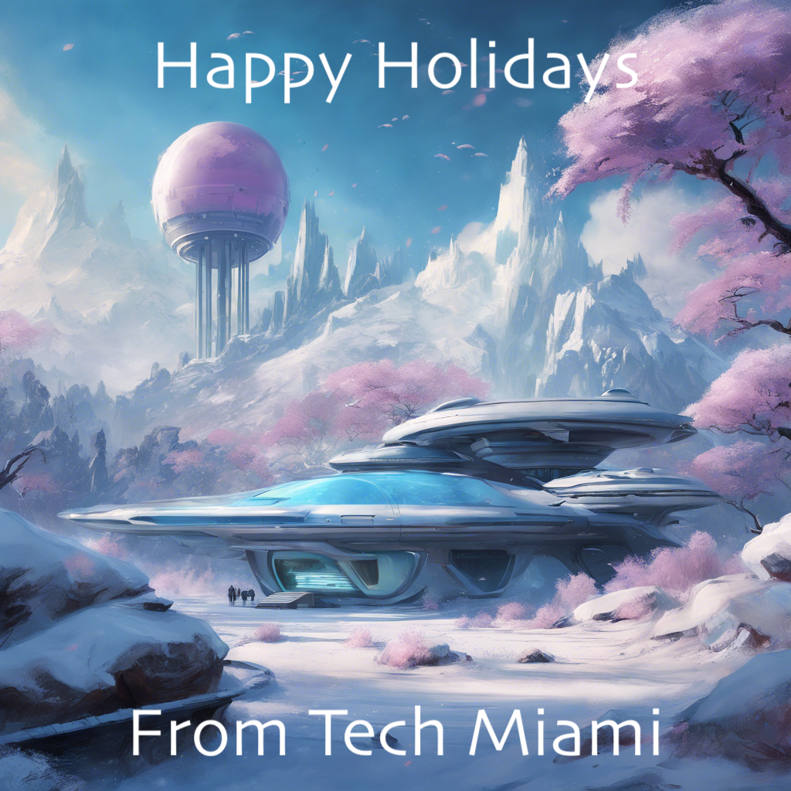

---

comments: false 
hide: 
    - navigation
    - toc
---

# Welcome to **Tech Miami**

!!! tip "Our Mission"
    To empower individuals and businesses with **future-ready tech skills**, fostering innovation and collaboration in Miami's thriving tech community.
___

### [Services](services.md)

- :tada: **One-on-One Tutoring**  
  Unlock your potential with personalized tutoring sessions designed to jumpstart or accelerate your tech journey.

- :briefcase: **Business Consulting**  
  Collaborate with industry experts to refine your processes, quality check your workflows, and drive digital transformation with confidence.

### Learning and Networking Resources

- :books: **Knowledge & Resource Sharing**  
  Dive into a wealth of [resources, tutorials](types-of-programming.md), and [blog](blog/index.md) articles tailored for both beginners and seasoned professionals.

- :handshake: **Local Connects & Networking**  
  Join our vibrant community by contributing to GitHub projects, engaging in discussions on the embdedded discussion threads on each article, and attending local tech events in Miami (stay tuned!).

___

#### Beginner's Resources:  
- [Introduction to Computer Programming](types-of-programming.md)
- [Learning to Code - First Steps](beginning-to-code.md)

#### Intermediate/Advanced Resources:  
- [Self-Hosting - Empowering You with Control and Privacy](self-hosting.md)

#### Latest Blog Posts: 
- :new: [The Power of Map Visualization in R](blog/posts/r-map-visualization.md)
- :new: [Unlocking the Power of Gen AI: A Deep Dive into RAG, Agents, and Workflows](blog/posts/genai-supertopic.md)
- :new: [Introduction to APIs and Creating a Simple One with Docker](blog/posts/simple-api.md)
- :new: [Norms for Success in Tech R&D/IT/DevOps/Tech Engineering](blog/posts/norms-for-success.md) 
- [Business Intelligence (BI) Tools: A Comprehensive Guide](blog/posts/bi-tools.md)
- [Exploring the Diverse World of Tech R&D Jobs](blog/posts/jobs-tech-rd.md)
- [Setting Up a Webhook Programmatically](blog/posts/setting-up-a-webhook.md)
- [Effective Project Planning: Leveraging Social Media and Specialized Tools](blog/posts/tools-for-project-management.md)
- [Running a Local Large Language Model with Docker](blog/posts/llm-docker-container.md)
- [Behind the Tech Miami Site](blog/posts/behind-the-site.md)
- [Dynamic Decision-Making: A Recursive Model for Achieving Goals](blog/posts/decision-model.md)
- [Unleashing the Power of AI in Modern Web Development: A Game-Changer for Developers](blog/posts/ai-today.md)
- [Getting Started with Docker: A Beginner's Guide](blog/posts/getting-started-with-docker.md)
- [Exploring the Tech Landscape in Miami: Opportunities and Growth](blog/posts/who-we-are.md)

___
 
We wish you and yours a very happy holidays season. Use the time to refresh your batteries, connect with those close to you, and appreciate all the good things. May 2025 bring us all a newfound thirst for knowledge, creativity, genuinity and innovation.

