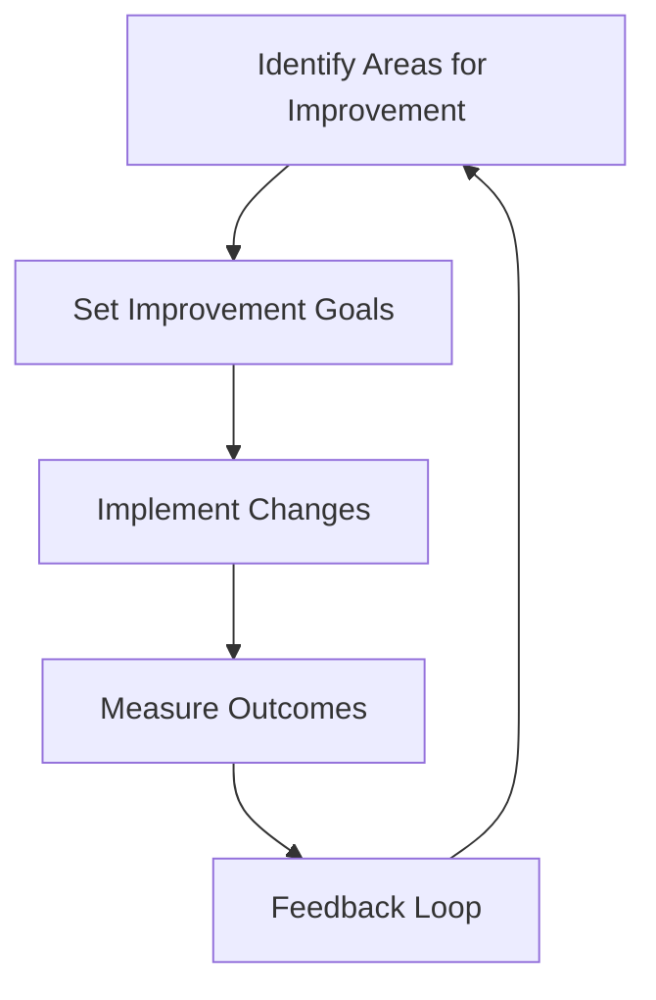

# **Norms for Success in Tech R&D/IT/DevOps/Tech Engineering**

In the fast-paced and innovative world of Tech R&D, IT, DevOps, and Tech Engineering, certain norms can make all the difference between success and stagnation. By establishing and embracing a set of shared values and principles, individuals and teams can work together more effectively, drive progress, and achieve their goals. This article delves deeply into six essential norms for success, exploring their theoretical underpinnings, practical applications, and measurable benefits.

<!-- more -->

---

### 1. Team and Personal Values

In Tech R&D/IT/DevOps/Tech Engineering, team and personal values serve as a compass, guiding behavior, decision-making, and collaboration.

#### Key Values and Their Importance

- **Curiosity and Continuous Learning:** The rapid evolution of technology demands an insatiable curiosity and commitment to ongoing education. Teams that embrace continuous learning remain adaptable and competitive.
- **Collaboration and Open Communication:** Collaboration amplifies creativity, while open communication fosters transparency and trust—essential ingredients for innovation.
- **Experimentation and Calculated Risk-Taking:** Encouraging experimentation within defined boundaries allows teams to innovate while mitigating potential setbacks.
- **Quality and Attention to Detail:** High-quality outputs in software development and systems engineering hinge on meticulous attention to detail, reducing technical debt and ensuring user satisfaction.
- **Adaptability and Resilience:** Resilient teams can pivot in response to shifting priorities and unforeseen challenges, maintaining productivity and morale.

#### Practical Implementation

- Conduct workshops to define team values collaboratively.
- Establish measurable goals aligned with these values.
- Regularly revisit and refine values to ensure alignment with organizational objectives.

---

### 2. Communication Culture

Effective communication forms the bedrock of successful tech teams, enabling them to navigate complexity and achieve alignment.

#### Core Components of Communication Culture

- **Clear and Concise Documentation:** Comprehensive documentation is essential for onboarding, troubleshooting, and cross-functional collaboration.
- **Regular Stand-Ups and Feedback Sessions:** These foster alignment, enable early problem identification, and enhance accountability.
- **Active Listening and Empathy:** Empathy reduces conflict, while active listening ensures mutual understanding and respect.
- **Diverse Communication Channels:** Balancing synchronous and asynchronous communication ensures inclusivity and efficiency.

#### Tools and Technologies

- Use project management tools like Jira or Trello to centralize task communication.
- Adopt collaborative platforms such as Slack, Microsoft Teams, or Zoom for real-time interactions.
- Implement knowledge bases like Confluence or Notion to maintain documentation.

---

### 3. Giving and Receiving Feedback

Feedback is the cornerstone of professional growth and operational improvement in Tech R&D/IT/DevOps/Tech Engineering.

#### Best Practices

- **Code Reviews and Pair Programming:** Regular code reviews enhance code quality and knowledge sharing.
- **Constructive Criticism:** Focus on behavior or output rather than personal attributes, ensuring feedback is actionable.
- **Feedback Loops:** Continuous feedback loops—via retrospectives and one-on-one meetings—enable iterative improvements.
- **Psychological Safety:** A safe environment encourages team members to voice concerns and share ideas without fear of reprisal.

#### Measuring Impact

- Track improvements in code quality using static analysis tools.
- Use anonymous surveys to assess team satisfaction with feedback mechanisms.

---

### 4. Accountability

Accountability ensures that teams and individuals take ownership of their work, fostering reliability and trust.

#### Key Strategies

- **Establish Clear Objectives:** Use SMART (Specific, Measurable, Achievable, Relevant, Time-bound) criteria for goal setting.
- **Define Ownership:** Clearly delineate responsibilities using tools like RACI matrices.
- **Transparency:** Leverage dashboards to provide real-time visibility into progress and metrics.
- **Post-Mortem Analysis:** Conduct blameless post-mortems to uncover root causes of failures and prevent recurrence.

#### Example: Accountability in DevOps

A team using CI/CD pipelines can monitor deployment success rates. Frequent errors might trigger an automated post-mortem process, documenting lessons learned and distributing responsibility for remediation.

---

### 5. Recognition

Recognition is a powerful motivator, driving engagement and reinforcing positive behaviors.

#### Strategies for Effective Recognition

- **Public Acknowledgment:** Celebrate achievements in all-hands meetings or through company-wide communication.
- **Personalized Rewards:** Align rewards with individual preferences—e.g., extra time off, professional development opportunities, or monetary bonuses.
- **Celebrate Milestones:** Host events or send thank-you notes for project completions, anniversaries, or individual achievements.

#### The Psychology of Recognition

Research shows that recognition releases dopamine, enhancing motivation and reinforcing desired behaviors. Teams with regular recognition programs report higher retention and satisfaction rates.

---

### 6. Continuous Improvement and Learning

The dynamic nature of technology necessitates a commitment to lifelong learning and process refinement.

#### Frameworks for Continuous Improvement

- **Kaizen:** Embrace small, incremental changes that lead to sustained improvements over time.
- **Agile and DevOps Practices:** Iterative development cycles and continuous integration/delivery ensure agility and responsiveness.
- **Knowledge Sharing:** Establish internal training programs and encourage attendance at industry conferences.

#### Tools for Learning and Growth

- Use learning platforms like Udemy, Pluralsight, or LinkedIn Learning to upskill teams.
- Implement internal wikis or documentation hubs to share knowledge.
- Encourage innovation labs or hackathons to stimulate creativity.

---

### Annotated Diagram: Continuous Improvement Workflow

This diagram illustrates the cyclical nature of continuous improvement, highlighting feedback as a pivotal component.

---

### Conclusion

By embracing these six norms for success, teams in Tech R&D/IT/DevOps/Tech Engineering can create a culture of innovation, collaboration, and continuous growth. Remember, these norms are not static; they evolve as the team and organization grow. Regularly revisiting and refining these principles ensures sustained success in the ever-changing tech landscape.

