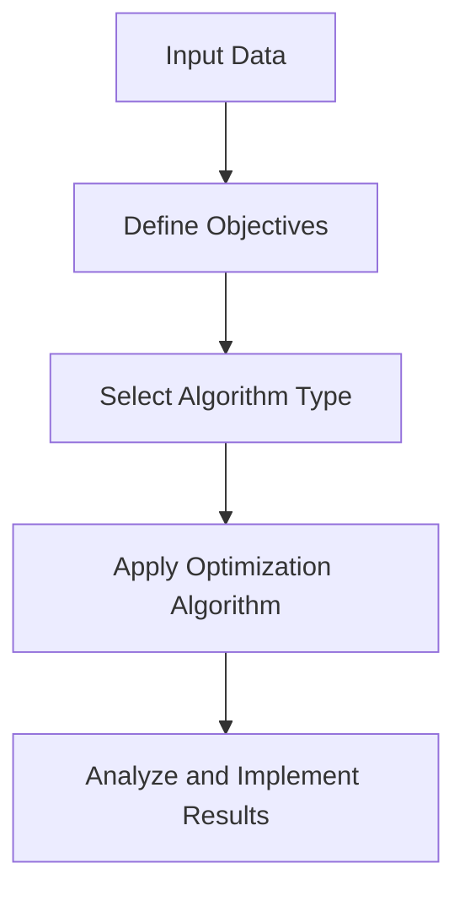

# **Optimization Algorithms: Unlocking Efficiency in Tech Automation**

In the realm of tech automation, optimization algorithms play a vital role in streamlining processes, reducing costs, and enhancing overall performance. These algorithms are designed to find the best solution among a set of possible solutions, often with constraints and trade-offs. In this article, we'll delve into the world of optimization algorithms, exploring their applications, types, and benefits in the context of tech automation.

<!-- more -->

---

**What are Optimization Algorithms?**
------------------------------------

Optimization algorithms are mathematical techniques used to optimize a function or a system, typically by minimizing or maximizing a specific objective. In tech automation, these algorithms are employed to improve the efficiency, speed, and accuracy of various processes, such as:

* **Resource allocation**: Optimization algorithms can help allocate resources, like computing power, memory, or network bandwidth, to ensure that systems operate at maximum capacity.
* **Process scheduling**: These algorithms can optimize the scheduling of tasks, jobs, or workflows to minimize delays, reduce idle time, and increase throughput.
* **Predictive maintenance**: Optimization algorithms can be used to predict when equipment or systems are likely to fail, allowing for proactive maintenance and reducing downtime.

---

**Types of Optimization Algorithms**
--------------------------------------

There are several types of optimization algorithms, each with its strengths and weaknesses. Some of the most commonly used algorithms in tech automation include:

* **Linear Programming (LP)**: LP algorithms are used to optimize linear objective functions, subject to linear constraints. They're commonly applied in resource allocation, scheduling, and logistics.
* **Integer Programming (IP)**: IP algorithms are used to optimize integer-valued variables, often in combination with LP. They're useful for solving problems with discrete variables, such as scheduling or resource allocation.
* **Dynamic Programming (DP)**: DP algorithms are used to optimize complex problems by breaking them down into smaller sub-problems. They're often applied in areas like predictive maintenance, inventory control, or supply chain management.
* **Genetic Algorithms (GA)**: GA algorithms are inspired by evolutionary biology and use principles of natural selection and genetics to search for optimal solutions. They're commonly used in areas like machine learning, artificial intelligence, or optimization of complex systems.
* **Simulated Annealing (SA)**: SA algorithms are used to optimize complex problems by iteratively applying a set of random perturbations to the solution space. They're often applied in areas like scheduling, logistics, or resource allocation.

---

**Applications of Optimization Algorithms in Tech Automation**
-----------------------------------------------------------

Optimization algorithms have numerous applications in tech automation, including:

* **Automated workflow management**: Optimization algorithms can be used to automate workflow management, ensuring that tasks are executed in the most efficient order and with minimal delay.
* **Predictive analytics**: Optimization algorithms can be used to analyze data and predict future trends, allowing for proactive decision-making and optimization of processes.
* **Resource optimization**: Optimization algorithms can be used to optimize resource allocation, reducing waste and improving overall efficiency.
* **Quality control**: Optimization algorithms can be used to monitor and optimize quality control processes, ensuring that products or services meet the required standards.

---

**Benefits of Optimization Algorithms in Tech Automation**
-----------------------------------------------------------

The benefits of optimization algorithms in tech automation are numerous, including:

* **Improved efficiency**: Optimization algorithms can help reduce waste, minimize delays, and improve overall efficiency.
* **Increased productivity**: By automating workflows and optimizing processes, optimization algorithms can help increase productivity and reduce manual labor.
* **Enhanced decision-making**: Optimization algorithms can provide valuable insights and predictions, enabling informed decision-making and proactive optimization of processes.
* **Reduced costs**: Optimization algorithms can help reduce costs by minimizing waste, optimizing resource allocation, and improving overall efficiency.

---

**Future Trends and Challenges**
-----------------------------------

The landscape of optimization algorithms is continually evolving, driven by advancements in computing power and machine learning. Key trends include:

* **Integration with AI and ML**: The combination of optimization algorithms with artificial intelligence and machine learning is enabling more intelligent and adaptive systems.
* **Quantum optimization**: As quantum computing matures, optimization algorithms are being developed to leverage quantum capabilities, promising breakthroughs in solving highly complex problems.
* **Scalability and adaptability**: Modern systems require algorithms that can scale with increasing data and adapt to dynamic environments.

However, challenges remain, such as:

* **Computational complexity**: Some algorithms are computationally expensive, making them impractical for large-scale systems without high-performance computing resources.
* **Data quality**: Optimization is only as good as the data used. Poor-quality or incomplete data can lead to suboptimal solutions.
* **Ethical considerations**: The use of optimization in sensitive areas, such as hiring or resource distribution, raises ethical concerns that must be addressed.

---

**Conclusion**
----------

Optimization algorithms are a cornerstone of tech automation, unlocking unprecedented efficiency, productivity, and innovation. By leveraging the right algorithms for the right applications, organizations can navigate the complexities of modern technology landscapes and achieve transformative results. As the field continues to advance, staying informed about emerging trends and addressing associated challenges will be crucial for maximizing the potential of these powerful tools.

---

**Annotations**

!!! note "Optimization Types"
    Choose the algorithm type based on the problem's structure and constraints. For example, linear programming is ideal for continuous variables, while genetic algorithms suit problems with complex, non-linear relationships.

!!! warning "Data Dependency"
    Optimization outcomes heavily depend on the quality of input data. Ensure robust data preprocessing to avoid skewed results.

!!! tip "Iterative Refinement"
    Start with simpler algorithms and gradually explore more complex ones to balance performance and computational cost.
