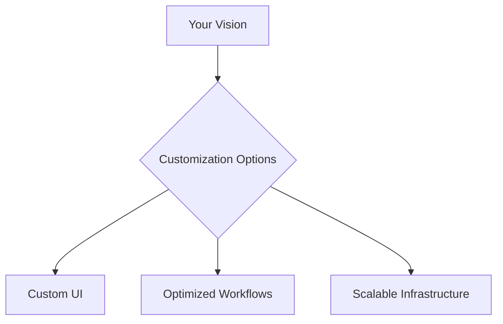
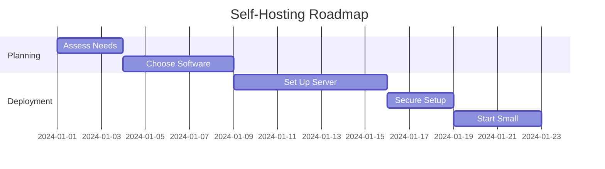

# Self-Hosting: Empowering You with Control and Privacy

Self-hosting provides an incredible opportunity to run and maintain your own web services and applications. By taking ownership of your digital ecosystem, you unlock greater control, enhanced privacy, and limitless customization options. This guide delves deep into the benefits of self-hosting and introduces practical steps to get started, enhanced by interactive diagrams and Material for MkDocs features.

---

## Why Self-Host?

### Control Your Data

Take back control of your data from third-party providers. When you self-host, your data stays within your infrastructure, giving you the power to set permissions, monitor access, and define how your information is used.

- **Key Benefits:** Ownership, no reliance on external terms of service, and ability to set up granular controls.

### Enhance Privacy

Eliminate exposure to data mining and surveillance often associated with cloud providers. With self-hosting, your sensitive data never leaves your control, providing peace of mind and ensuring compliance with privacy regulations.

- **Examples:** Use self-hosted email servers, encrypted file storage, and private messaging platforms.

### Unmatched Customization

Design your services to fit your specific needs. From UI tweaks to custom workflows, self-hosting allows you to implement changes that align with your personal or organizational goals.

---

## Resource Highlight: Awesome-Selfhosted

The [Awesome-Selfhosted](https://github.com/awesome-selfhosted/awesome-selfhosted) repository is a treasure trove of open-source software that you can host yourself. It includes:

- **Content Management Systems (CMS):** Host your blogs or websites.
- **File Synchronization Tools:** Keep your files safe and accessible.
- **Media Servers:** Manage and stream your media collections.
- **Development Tools:** Build and deploy your projects seamlessly.

Explore the full list on the [Awesome-Selfhosted GitHub repository](https://github.com/awesome-selfhosted/awesome-selfhosted) or their beautifully designed [website](https://awesome-selfhosted.net/).

---

## Getting Started

1. **Assess Your Needs:** Identify the services you want to host.
2. **Set Up a Server:** Use a local machine, VPS, or NAS device.
3. **Choose Software:** Refer to [Awesome-Selfhosted](https://github.com/awesome-selfhosted/awesome-selfhosted) for recommendations.
4. **Secure Your Setup:** Implement firewalls, HTTPS, and regular backups.
5. **Start Small:** Begin with simple applications to build your confidence.

---

## Quick Links

- [Awesome-Selfhosted Repository](https://github.com/awesome-selfhosted/awesome-selfhosted)
- [Self-Hosting Guide](https://awesome-selfhosted.net/)

---

Self-hosting empowers you to reclaim your digital independence. Start your journey today and explore the endless possibilities!

