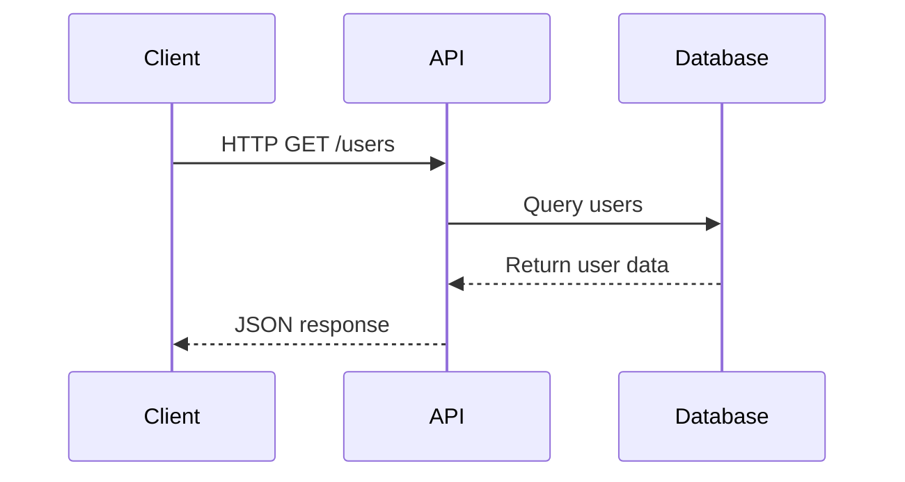

# **Introduction to APIs and Creating a Simple One with Docker**

### What is an API?

An Application Programming Interface (API) is a set of defined rules that enable different software systems to communicate with each other. It allows one system to request services or data from another system, and receive the response in a structured format. APIs act as intermediaries between systems, enabling them to exchange information and perform actions on each other's behalf.

<!-- more -->

Think of an API as a restaurant. You, the customer, are like a client requesting food (data or services). The kitchen, representing the server, prepares your order and sends it back to you through the waiter (API). You don't need to know how the kitchen works or how the food is prepared; you simply send your request and receive the response.

### Types of APIs

APIs come in various forms, each serving specific purposes. The most common types include:

1. **REST (Representational State Transfer)**: 
   - Based on standard HTTP methods like GET, POST, PUT, and DELETE.
   - Typically returns data in JSON format.
   - Easy to use and widely adopted.

2. **SOAP (Simple Object Access Protocol):**
   - Uses XML for message formatting.
   - Includes built-in error handling.
   - Preferred for secure and transactional applications.

3. **GraphQL:**
   - Allows clients to request only the data they need.
   - Reduces over-fetching and under-fetching issues.
   - Ideal for applications with complex data relationships.

4. **Webhooks:**
   - Triggered by specific events and send real-time data to other systems.
   - Commonly used for notifications and integrations.

Each type has its own use cases and is suited for specific scenarios, depending on the needs of your application.

### Different Languages/Implementations

APIs can be built using various programming languages and frameworks. Some popular choices include:

* **Python with Flask or Django**: Known for their simplicity and flexibility, these frameworks are ideal for building RESTful APIs.
* **JavaScript with Node.js and Express**: A popular combination for real-time web applications and microservices.
* **Java with Spring Boot**: A robust and widely-used framework for building enterprise-level APIs.
* **Go with Gorilla**: A fast and lightweight framework for building scalable APIs.

Each language and framework has its strengths and weaknesses. The choice ultimately depends on the specific requirements of your project, your team's expertise, and the desired outcome.

### **Overview of Docker in API Development**

Docker is a platform that allows developers to package applications and their dependencies into lightweight containers. These containers can run consistently across various environments, eliminating the "it works on my machine" problem.

#### **Why Use Docker for APIs?**
- **Consistency**: Ensures the API behaves the same way in development, testing, and production.
- **Portability**: Containers can run on any system with Docker installed.
- **Isolation**: Keeps the API and its dependencies separate from the host system.
- **Scalability**: Makes it easier to scale APIs by running multiple containers.

By using Docker, you can streamline the API development lifecycle, improve collaboration, and simplify deployment.

### **Creating a Simple API with Docker**

In this example, we'll create a simple API using Python, Flask, and Docker. Our API will have two endpoints: one to greet the user and another to return a list of users.

---
**Step 1: Install Requirements and Create a New Flask Project**

First, install Flask using pip:
```bash
pip install flask
```
Create a new file called `app.py` and add the following code:
```python
from flask import Flask, jsonify

app = Flask(__name__)

# Sample in-memory data store
users = [
    {"id": 1, "name": "John Doe"},
    {"id": 2, "name": "Jane Doe"}
]

@app.route("/greet", methods=["GET"])
def greet():
    return "Hello, World!"

@app.route("/users", methods=["GET"])
def get_users():
    return jsonify(users)

if __name__ == "__main__":
    app.run(debug=True)
```
This code defines a basic Flask application with two endpoints: `/greet` and `/users`.

---
**Step 2: Create a Dockerfile and Build the Image**

Create a new file called `Dockerfile` in the same directory as your `app.py` file:
```dockerfile
FROM python:3.9-slim

# Set the working directory
WORKDIR /app

# Copy the requirements file
COPY requirements.txt .

# Install the dependencies
RUN pip install -r requirements.txt

# Copy the application code
COPY app.py .

# Expose the port
EXPOSE 5000

# Run the command to start the development server
CMD ["python", "app.py"]
```
This Dockerfile uses the official Python 3.9 image, sets up the working directory, installs the dependencies, copies the application code, exposes port 5000, and sets the default command to start the development server.

---
**Step 3: Build and Run the Docker Container**

Run the following commands to build the Docker image and start a new container:
```bash
docker build -t my-api .
docker run -p 5000:5000 my-api
```
This will build the Docker image and start a new container from it, mapping port 5000 on the host machine to port 5000 in the container.

---
**Step 4: Test the API**

Open a web browser and navigate to `http://localhost:5000/greet` to see the greeting message. You can also use a tool like `curl` to test the API endpoints:
```bash
curl http://localhost:5000/greet
curl http://localhost:5000/users
```
This should return the greeting message and the list of users, respectively.

### **Expanding the Example**

#### **Adding Authentication**
To make your API more secure, consider adding authentication using libraries like Flask-JWT-Extended. This allows you to implement token-based authentication and protect your endpoints.

#### **Integrating a Database**
Instead of using an in-memory data store, integrate a database like PostgreSQL or MongoDB. Docker Compose can help manage multiple containers for your API and database.

#### **Mermaid Diagram**
Here’s a simple sequence diagram showing how the API interacts with a client:


### **Conclusion**

Congratulations! You've just created a simple API with Docker using Python and Flask. This example is a starting point to build more complex and robust APIs. By incorporating features like authentication, database integration, and scaling, you can create production-ready APIs for various use cases. Remember to follow best practices for API design, testing, and deployment to ensure your API is robust, scalable, and maintainable.


___ 
