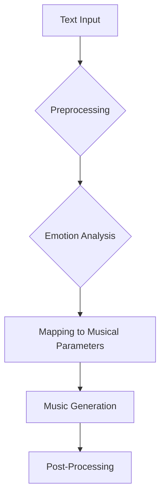

# **Text to Music/Audio: Unlocking the Harmony of Language**

### Introduction

The intersection of text and music has captivated researchers and artists for decades. Text-to-music conversion, the process of transforming written or spoken language into musical compositions, bridges the fields of linguistics, music theory, and artificial intelligence. This innovative domain holds the potential to revolutionize music creation, therapy, and artistic expression by translating linguistic structures into harmonic, melodic, and rhythmic elements.

This article explores the theoretical underpinnings, applicatory methods, current platforms, strategies, and limitations of text-to-music conversion. We also highlight modern advancements, such as the contributions of platforms like **Suno** and **Stability Audio**, in pushing the boundaries of this field.

### Theory

The foundation of text-to-music conversion lies in the assumption that language and music share structural parallels. Both rely on patterns, hierarchies, and rhythms to convey meaning and emotion. By decoding these relationships, researchers aim to develop frameworks that translate textual input into musical output.

#### Key Theoretical Concepts

1. **Phoneme-to-Note Mapping**
   - Phonemes, the smallest units of sound in a language, can be assigned to individual musical notes. This method creates a direct auditory representation of textual elements.

2. **Syllable-Based Rhythm**
   - Text syllables are mapped to rhythmic patterns, reflecting the cadence of spoken language. For example, a haiku might inspire a rhythmically sparse yet impactful musical motif.

3. **Sentential Melody**
   - Sentence structures influence melodic contours. Declarative sentences might correspond to descending melodic phrases, while interrogative sentences could ascend.

4. **Semantic Emotion Mapping**
   - Emotional connotations of words guide the choice of musical modes, dynamics, and textures. For instance, "joy" might correspond to a major key, while "melancholy" aligns with a minor key.

### Applicatory Theory

Practical implementations of text-to-music conversion rely on computational models that integrate linguistic and musical principles. Modern advancements leverage both machine learning and rule-based approaches to achieve nuanced and dynamic results.

#### Methodologies

1. **Machine Learning Approaches**
   - Artificial neural networks are trained on large datasets of text and music to uncover patterns and generate compositions. **Transformer-based models**, similar to those used in natural language processing, are particularly effective in understanding context and generating coherent musical pieces.

2. **Rule-Based Systems**
   - These systems use predefined linguistic and musical rules to create music. For example, a rule might dictate that verbs trigger staccato notes, while nouns correspond to legato phrases.

3. **Hybrid Approaches**
   - Combining the flexibility of machine learning with the precision of rule-based systems allows for greater customization and adaptability.

#### Applications

- **Music Therapy**: Generating personalized therapeutic compositions based on textual input, such as journal entries or emotional reflections.
- **Creative Assistance**: Assisting composers by providing musical sketches derived from lyrics or poetry.
- **Education**: Teaching linguistic or musical concepts through interactive, text-driven music generation tools.

### Platforms

Several platforms have emerged as pioneers in text-to-music conversion, offering diverse functionalities and use cases:

1. **Amper Music**
   - Uses AI to generate customizable music tracks from textual descriptions.

2. **AIVA (Artificial Intelligence Virtual Artist)**
   - Specializes in composing music for various purposes, including video game soundtracks and personal projects.

3. **Music21**
   - A Python library designed for computational musicology, with tools for text-to-music conversion and analysis.

4. **Suno**
   - A cutting-edge platform focused on generating high-quality, emotion-driven audio from text inputs, incorporating advanced deep learning techniques.

5. **Stability Audio**
   - An emerging platform emphasizing generative AI for creating intricate and stylistically diverse music, offering tools for both professionals and enthusiasts.

### Strategies

To enhance the output quality and effectiveness of text-to-music conversion, the following strategies can be employed:

#### Preprocessing
- **Text Normalization**: Remove punctuation, correct grammar, and standardize input to reduce noise in the conversion process.
- **Emotion Analysis**: Identify emotional tone to influence the musical style and dynamics.

#### Generation Techniques
- **Musical Style Transfer**: Borrow stylistic elements from existing compositions to influence the generated music.
- **Dynamic Layering**: Incorporate multiple layers (e.g., harmony, rhythm, texture) to create more complex and engaging pieces.

#### Post-Processing
- Apply audio effects such as reverb, delay, and equalization to enhance the sound quality of the generated music.
- Fine-tune dynamics and tempo to align with the intended emotional expression.

### Limitations

While promising, text-to-music conversion faces significant challenges:

1. **Linguistic Complexity**
   - The nuances of human language, including idiomatic expressions and cultural references, complicate the mapping process.

2. **Musical Quality**
   - Outputs can sometimes lack the depth and creativity inherent in human compositions, leading to formulaic results.

3. **Computational Limitations**
   - High-quality generation requires significant computational resources, which may be inaccessible to some users.

4. **Creativity and Intuition**
   - AI systems struggle to replicate the spontaneous creativity and emotive intuition of human composers.

### Visualizing Text-to-Music Conversion

Below is a Mermaid diagram illustrating the workflow of text-to-music conversion:

### Conclusion

The future of text-to-music conversion lies in refining theoretical frameworks, advancing computational models, and addressing current limitations. As platforms like **Suno** and **Stability Audio** continue to innovate, the potential for creating deeply personalized and emotionally resonant music grows. This burgeoning field offers exciting possibilities for musicians, therapists, educators, and technologists alike, promising to harmonize the beauty of language with the universal appeal of music.
