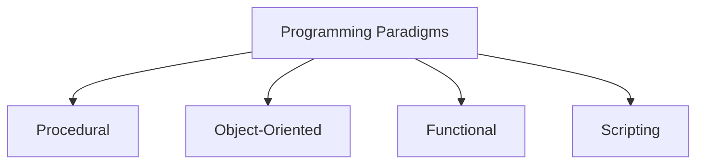

---

comments: true
---

# **Introduction to Computer Programming**

Programming is the art of telling computers what to do. Whether you're building websites, developing games, analyzing data, or creating machine learning models, programming gives you the tools to make your ideas a reality. This guide will explore the **different types of programming**, offering insights, examples, and useful resources for beginners.

---

## **What is Programming?**

Programming is the process of writing instructions that a computer can execute. These instructions, called **code**, are written in **programming languages**. Different programming languages and paradigms are suited for specific tasks.

> **Tip:** Learning the basics of one language can make it easier to pick up others.

---

## **Types of Programming**

### 1. **Procedural Programming**
- **Description:** A programming paradigm that uses a step-by-step approach with procedures or routines (functions).
- **Examples of Languages:** C, Pascal, Python

```python
# Example of Procedural Programming in Python

def greet(name):
    print(f"Hello, {name}!")

greet("World")
```

### 2. **Object-Oriented Programming (OOP)**
- **Description:** Focuses on objects that represent real-world entities and their interactions.
- **Examples of Languages:** Java, Python, C++

```python
# Example of Object-Oriented Programming in Python

class Animal:
    def __init__(self, name):
        self.name = name

    def speak(self):
        print(f"{self.name} makes a noise.")

cat = Animal("Cat")
cat.speak()
```

### 3. **Functional Programming**
- **Description:** Uses functions as the primary building blocks and avoids changing states or mutable data.
- **Examples of Languages:** Haskell, Lisp, Python

```python
# Example of Functional Programming in Python

add = lambda x, y: x + y
print(add(2, 3))
```

### 4. **Scripting Programming**
- **Description:** Writing small programs to automate tasks.
- **Examples of Languages:** Python, Bash, JavaScript

```bash
# Example of a simple Bash script

echo "Hello, World!"
```

---

## **Comparison Table of Programming Paradigms**

| **Paradigm**       | **Key Feature**                 | **Best For**                  | **Examples**        |
|--------------------|---------------------------------|------------------------------|---------------------|
| Procedural         | Step-by-step instructions      | General purpose              | C, Python           |
| Object-Oriented    | Objects and interactions       | Large-scale software         | Java, C++           |
| Functional         | Functions and immutability     | Data analysis, AI            | Haskell, Lisp       |
| Scripting          | Task automation                | Automation, web scripting    | Bash, Python        |

---

## **Visualizing Programming Paradigms**



---

## **How to Choose Your First Programming Language**

> "The best language to start with is the one that gets you excited to code."

### **Key Factors to Consider:**

1. **Your Goals:**
    - Want to build websites? Try **JavaScript**.
    - Interested in data science? Go for **Python**.

2. **Ease of Learning:**
    - Beginner-friendly: Python, Scratch

3. **Community Support:**
    - Large and active communities make learning easier.

### **Recommended Languages for Beginners:**

| **Language** | **Why It’s Great**        |
|--------------|--------------------------|
| Python       | Simple syntax, versatile |
| JavaScript   | For web development      |
| Scratch      | Visual, drag-and-drop    |

---

## **Additional Resources**

### **Books**
- "Automate the Boring Stuff with Python" by Al Sweigart
- "You Don’t Know JS" by Kyle Simpson

### **Online Tutorials**
- [freeCodeCamp](https://www.freecodecamp.org)
- [Khan Academy](https://www.khanacademy.org)

### **Tools for Practice**
- **Interactive Platforms:** [Replit](https://replit.com), [CodePen](https://codepen.io)
- **Challenges:** [HackerRank](https://www.hackerrank.com), [LeetCode](https://leetcode.com)

---

## **Next Steps**

1. Pick a language and start practicing.
2. Build simple projects (e.g., a calculator, a to-do app).
3. Explore advanced topics like algorithms, debugging, and version control.

> **Remember:** Progress is progress, no matter how small. Keep coding!

---

**Happy Coding!** 
